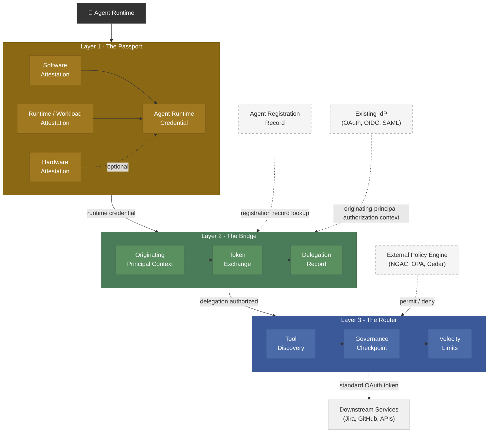
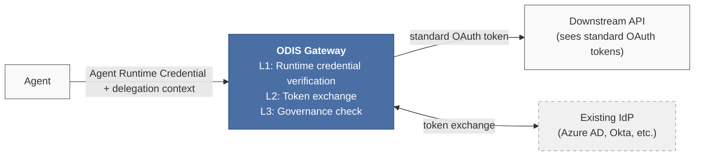
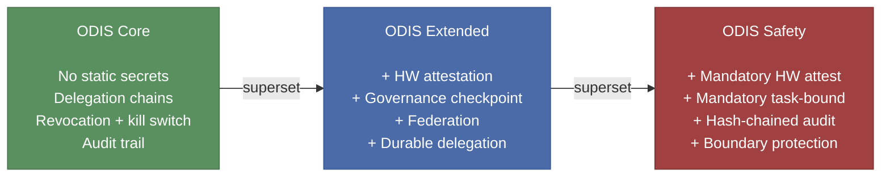

# Table of contents

- [Abstract](#abstract)
- [1. Executive Summary](#1-executive-summary)
  - [1.1 What ODIS Specifies](#11-what-odis-specifies)
  - [1.2 Design Principles](#12-design-principles)
  - [1.3 Terminology: Identifier vs Credential](#13-terminology-identifier-vs-credential)
  - [1.4 Normative Terminology](#14-normative-terminology)
- [2. Problem Statement — The Four Pillars](#2-problem-statement--the-four-pillars)
  - [2.1 Pillar 1 — Delegated Principal Identity](#21-pillar-1--delegated-principal-identity)
  - [2.2 Pillar 2 — Agent Code/Package Identity](#22-pillar-2--agent-codepackage-identity)
  - [2.3 Pillar 3 — Agent Runtime Instance Identity](#23-pillar-3--agent-runtime-instance-identity)
  - [2.4 Pillar 4 — Cascaded Delegation](#24-pillar-4--cascaded-delegation)
  - [2.5 Cross-Cutting Constraint — Backward Compatibility](#25-cross-cutting-constraint--backward-compatibility)
- [3. Architectural Model — The Three Layers](#3-architectural-model--the-three-layers)
  - [3.1 Layer 1 — The Passport (Identity & Attestation)](#31-layer-1--the-passport-identity--attestation)
  - [3.2 Layer 2 — The Bridge (Delegation & Access)](#32-layer-2--the-bridge-delegation--access)
  - [3.3 Layer 3 — The Router (Discovery & Governance)](#33-layer-3--the-router-discovery--governance)
  - [3.4 Identity / Policy Separation (ODIS Scope Boundary)](#34-identity--policy-separation-odis-scope-boundary)
  - [3.5 Reference Component Model](#35-reference-component-model)
  - [3.6 End-to-End Reference Flow](#36-end-to-end-reference-flow)
- [4. Prior Art & Industry Landscape](#4-prior-art--industry-landscape)
  - [4.1 Standards Bodies](#41-standards-bodies)
  - [4.2 Hyperscaler Implementations](#42-hyperscaler-implementations)
  - [4.3 How ODIS Relates to Prior Art](#43-how-odis-relates-to-prior-art)
- [5. Requirements](#5-requirements)
  - [5.1 Layer 1 — Identity & Attestation](#51-layer-1--identity--attestation)
  - [5.2 Layer 2 — Delegation & Access](#52-layer-2--delegation--access)
  - [5.3 Layer 3 — Discovery & Governance](#53-layer-3--discovery--governance)
  - [5.4 Cross-Cutting Requirements](#54-cross-cutting-requirements)
- [6. Data Models](#6-data-models)
  - [6.1 Agent Registration Record](#61-agent-registration-record)
  - [6.2 Agent Runtime Credential Descriptor](#62-agent-runtime-credential-descriptor)
  - [6.3 Delegation Record](#63-delegation-record)
  - [6.4 Identity Context (Policy Engine Feed)](#64-identity-context-policy-engine-feed)
- [7. Interoperability & Migration](#7-interoperability--migration)
  - [7.1 Integration with Existing Standards](#71-integration-with-existing-standards)
  - [7.2 Deployment Patterns](#72-deployment-patterns)
  - [7.3 Migration Path](#73-migration-path)
- [8. Conformance Profiles](#8-conformance-profiles)
  - [8.1 Profile Definitions](#81-profile-definitions)
  - [8.2 Conformance Declaration](#82-conformance-declaration)
  - [8.3 Provider Adapter Capability Manifest](#83-provider-adapter-capability-manifest)
  - [8.4 Profile Progression](#84-profile-progression)
- [9. Security Considerations](#9-security-considerations)
  - [9.1 Threat Model](#91-threat-model)
  - [9.2 Trust Boundaries](#92-trust-boundaries)
  - [9.3 Limitations](#93-limitations)
- [10. Governance & Future Work](#10-governance--future-work)
  - [10.1 Document Status and Governance](#101-document-status-and-governance)
  - [10.2 Contribution Model](#102-contribution-model)
  - [10.3 Future Work](#103-future-work)
- [11. References](#11-references)
  - [11.1 Normative References](#111-normative-references)
  - [11.2 Informative References](#112-informative-references)

## Abstract

ODIS defines an open, vendor-neutral architecture for establishing cryptographic identity, delegation, and governance for autonomous AI agents operating across enterprise trust domains. It augments OAuth 2.0 [\[RFC6749\]](#ref-rfc6749), OpenID Connect (OIDC) [\[OIDC-CORE\]](#ref-oidc-core), the Secure Production Identity Framework for Everyone (SPIFFE) [\[SPIFFE\]](#ref-spiffe), and System for Cross-domain Identity Management (SCIM) [\[RFC7643\]](#ref-rfc7643)[\[RFC7644\]](#ref-rfc7644), along with policy-engine infrastructure; it does not replace them.

ODIS addresses four foundational pillars of agentic identity: delegated principal identity, agent code or package identity, agent runtime instance identity, and cascaded multi-agent delegation. The architecture is organized as three implementation layers: Passport, Bridge, and Router.

This specification is designed for adoption by identity providers, cloud platforms, agent-framework developers, and enterprise security teams. Migration phases support incremental adoption, while conformance profiles define progressively stronger assurance requirements.

## 1. Executive Summary

The rapid proliferation of autonomous AI agents has destabilized traditional enterprise identity and access management (IAM) paradigms. Agents act asynchronously, spawn sub-agents across distributed trust domains, and execute thousands of operations per minute. Traditional IAM assumes a human user operating a client application within a single synchronous session — agentic systems break every one of those assumptions.

Two critical blockades prevent enterprises from achieving secure, scalable autonomous operations:

- **The Secret Zero Problem**: Developers provision agents with static API keys or long-lived service account secrets, creating massive blast-radius risk and enabling exfiltration via prompt injection.

- **The Browser Trap**: Agents attempting to traverse enterprise perimeters have their execution loops severed by interactive SSO or MFA prompts that headless agents cannot process.

ODIS-conformant implementations address both problems by replacing static secrets on the agent-authentication path with short-lived, attested Agent Runtime Credentials and replacing browser-bound continuity assumptions with delegated authorization and lifecycle-aware mediation.

### 1.1 What ODIS Specifies

ODIS specifies logical roles, mandatory security properties, abstract data models, and interoperability contracts for agent identity, delegation, and governance. ODIS does not require a monolithic implementation. Conformant deployments may place Layer 1, Layer 2, and Layer 3 in a gateway, sidecar, service mesh, SDK, cloud service, or any combination thereof, provided the required security properties are preserved.

### 1.2 Design Principles

1.  **Enabler, not blocker**: ODIS defines what must be true, not how it must be implemented. Multiple identity technologies, wire formats, and policy engines are supported.

2.  **Augmentation, not replacement**: Every ODIS layer is designed to overlay on existing OAuth 2.0, OIDC, SPIFFE, SAML, and SCIM infrastructure via translation/augmentation layers.

3.  **Incremental adoption**: The migration phases in Section 7.3 allow organizations to adopt ODIS layer by layer. Conformance profiles (Core, Extended, Safety) define progressively stronger assurance requirements for a declared conformance target.

4.  **Identity/policy separation**: ODIS specifies identity and delegation context plus mandatory validation and enforcement obligations at ODIS trust boundaries. Organization-specific policy decisions MAY be supplied by external policy engines. ODIS does not standardize a policy language or engine.

### 1.3 Terminology: Identifier vs Credential

An agent_id is a stable identifier for a logical agent or agent class. It is not a secret and is not sufficient to authenticate a running agent instance. Runtime authentication is performed using an Agent Runtime Credential: an ephemeral proof-of-possession credential issued to a specific running agent instance after successful attestation.

ODIS distinguishes:

1.  **Agent Registration Record**: the durable organizational governance record for a logical agent. It contains ownership, sponsor, lifecycle state, approved runtime identity issuers, approved software provenance, policy profile references, permitted delegation modes, and provider adapter entitlement mappings.

2.  **Agent Runtime Credential**: the short-lived proof-of-possession credential issued to a specific running agent instance after attestation. The runtime credential is not sufficient by itself to receive delegated authority; it MUST resolve to an active Agent Registration Record before Layer 2 issues or mediates downstream authority.

The Agent Registration Record is a control-plane governance record consulted at runtime. The issuer of Agent Runtime Credentials MAY be separate from the authority that manages Agent Registration Records. Conversely, a single platform MAY combine runtime credential issuance and registration-record management when it satisfies the same security properties.

Any deployment that authenticates a running agent instance solely by presenting a static identifier or long-lived shared secret is outside ODIS Core conformance.

### 1.4 Normative Terminology

1.  **Active Agent Registration Record:** An authenticated, integrity-protected Agent Registration Record whose lifecycle_state is active, whose version is the newest accepted version from its authoritative issuer, whose validity period includes the validation time, and that has not been revoked or superseded.

2.  **Authorized presenter:** An attested component explicitly authorized to construct or present holder-bound proofs for a specific Agent Runtime Credential and active Delegation Record.

3.  **Model-visible process:** Any execution context, memory, input, output, or tool interface that is directly accessible to model-generated or model-controlled execution.

4.  **ODIS-aware target:** A target that independently validates the Agent Runtime Credential and active Delegation Record and enforces their audience, holder binding, attenuation, constraints, freshness, and revocation semantics.

5.  **Confirmed compromise signal:** An authenticated, integrity-protected, replay-resistant, sufficiently fresh signal from a trusted issuer that is explicitly correlated to the affected registration, runtime instance, credential, delegation, task, or provider grant.

6.  **Delegation Record:** The per-hop artifact defined in Section 6.3, including its integrity-protected lineage. “Delegation Chain Record” does not identify a separate artifact.

## 2. Problem Statement — The Four Pillars

ODIS identifies four foundational pillars that must be addressed for secure, enterprise-grade agentic operations. These pillars define the minimum problem space for any practical agent identity and delegation standard.

### 2.1 Pillar 1 — Delegated Principal Identity

**Definition**: The mechanism by which an authenticated human or service principal’s intent and authorization context are conveyed to an agent acting on that principal’s behalf.

**Current state**: Strong building blocks already exist in OAuth 2.0, OIDC, and related delegated authorization systems for user-driven access control.

**Gap**: Existing enterprise authorization models assume an interactive user session, typically mediated through a browser, MFA prompt, or redirect flow. Autonomous and long-running agents break that assumption. They need a way to obtain, refresh, and use delegated authority without repeatedly forcing the human back into the execution loop. ODIS addresses this gap by defining a delegation layer that supports asynchronous approval, durable but bounded delegation, and preservation of originating-principal attribution and accountable sponsorship throughout the task lifecycle.

ODIS treats the originating principal and the executing agent as distinct authenticated subjects. ODIS-L2-01 defines the effective-authority intersection, and ODIS-CC-02 defines the corresponding attribution requirement.

### 2.2 Pillar 2 — Agent Code/Package Identity

**Definition**: The verifiable identity of the software artifact itself, proving what code or package is intended to run and whether it originates from a trusted source.

**Current state**: Mature practices exist for code signing, image signing, software attestation, SBOM generation, and supply-chain integrity verification.

**Gap**: In most current agent deployments, runtime authority is not tightly bound to a verified software artifact. A system may know that a package was signed at build time, but not reliably connect that fact to the specific running agent that is requesting authority at execution time. ODIS addresses this gap by requiring software attestation as part of the identity foundation, so authority is granted only to running agent instances whose software origin and integrity can be validated against a trusted distribution chain.

### 2.3 Pillar 3 — Agent Runtime Instance Identity

**Definition**: The cryptographic identity of a specific running agent instance, proving that this exact runtime is the one receiving delegated authority.

**Current state**: Technologies such as SPIFFE/SPIRE, cloud-native workload identity, and related attestation frameworks provide strong foundations for ephemeral agent runtime credentials and runtime identity.

**Gap**: Many deployed agents still authenticate using static API keys, long-lived service secrets, or durable directory credentials. That creates the Secret Zero problem and blurs the distinction between the Agent Registration Record and the ephemeral credential that authenticates a live agent runtime. ODIS addresses this gap by separating identifier, registration record, and runtime credential: a stable agent_id identifies the logical agent for lifecycle, audit, and policy reference; the Agent Registration Record determines whether the agent is recognized and authorized by the organization; and runtime authentication is performed only through a short-lived proof-of-possession Agent Runtime Credential issued after attestation and bound to the active agent runtime instance.

### 2.4 Pillar 4 — Cascaded Delegation

**Definition**: The secure propagation of authority, identity context, and intent when one agent invokes another agent across one or more trust boundaries.

**Current state**: This area remains immature. Early drafts and vendor-specific approaches exist, but there is no broadly adopted, portable model for preserving delegation lineage while enforcing safe narrowing across multiple agent hops.

**Gap**: Traditional OAuth scope handling is too coarse to model real multi-agent attenuation. A child agent should not merely receive a smaller string set; it should receive authority that is semantically equal to or narrower than its parent across resource, action, and constraint dimensions. Without that, sub-agents can become privilege amplification points. ODIS addresses this gap through a Delegation Record and semantic attenuation model that preserve chain-of-delegation context while enforcing monotonic narrowing.

### 2.5 Cross-Cutting Constraint — Backward Compatibility

Any practical standard for agent identity must work with existing enterprise identity and SaaS environments. ODIS therefore does not require downstream systems to understand ODIS-native claims or new token formats directly. Backward compatibility is achieved through Layer 2 translation and mediation. Provider Adapters translate ODIS delegation context into target-native credentials, roles, scopes, or mediated request paths suitable for existing downstream systems. This allows enterprises to adopt ODIS without waiting for every SaaS provider, cloud API, or internal service to implement a new native protocol.

**ODIS-native downstream path.** Translation is not required when a downstream system can independently validate the Agent Runtime Credential and the active Delegation Record and enforce their audience, holder-binding, attenuation, constraint, freshness, and revocation semantics. In this native mode, ODIS identity and delegation artifacts MAY be presented without translation. Otherwise, the Provider Adapter MUST use bridge mode to translate or mediate the approved authority and MUST enforce ODIS-L2-10.

## 3. Architectural Model — The Three Layers

ODIS organizes its solution as three implementation layers. Each layer has a defined role, clear input/output interfaces, and explicit boundaries.

ODIS three-layer architecture: the Agent Runtime is attested in Layer 1 and resolved to an Agent Registration Record; Layer 2 combines originating-principal context, token exchange, and a Delegation Record; Layer 3 applies discovery, governance, and velocity controls before downstream access.

*\[Diagram: ODIS Three-Layer Architecture showing Agent Runtime Credentials in Layer 1, delegation and token mediation in Layer 2, governance checks in Layer 3, and native or bridge-mode downstream service access.\]*



### 3.1 Layer 1 — The Passport (Identity & Attestation)

**Addresses**: Pillar 2 (agent code/package identity) + Pillar 3 (running agent instance identity). **Role**: Defines WHAT the software is and WHICH runtime instance is receiving authority.

Layer 1 establishes that a specific software artifact is running as a specific agent runtime instance before delegated authority can be issued or used. It binds attestation evidence into an ephemeral, holder-bound Agent Runtime Credential.

Layer 1 binds three identity claims into a single verifiable credential:

- **(a) Software attestation** — the agent’s code artifact is verified against a trusted registry or trusted supply chain, such as a container digest, binary signature, package provenance record, or equivalent.

- **(b) Runtime/Workload attestation** — the running instance is verified using platform-appropriate attestation, such as SPIFFE node/workload attestation, cloud workload identity, decentralized identity registration, or equivalent.

- **(c) Hardware attestation** (optional, for safety-critical or high-assurance deployments) — evidence about the execution environment, platform measurements, or protection of the holder key, obtained through a TEE, Confidential Computing mechanism, TPM-backed attestation, or equivalent. Hardware attestation MAY strengthen the binding between the verified software artifact and the running instance, but it MUST NOT replace software provenance verification or runtime/workload attestation.

ODIS does not mandate a specific identity technology. Conformant implementations MAY use:

- SPIFFE/SPIRE (centralized, X.509 SVIDs)

- Decentralized Identifiers using holder-bound cryptographic keys

- Cloud-native identity (e.g., GCP agent identity with CAA binding)

- Any mechanism satisfying the requirements in Section 5.1

**Core properties**:

- No static secrets. Agents MUST authenticate using ephemeral, cryptographically verifiable credentials. Static API keys, long-lived service account secrets, and credentials passed as environment variables must not be used.

- Proof-of-possession. Runtime credentials MUST be bound to a holder key; a stable identifier, directory object, or long-lived shared secret alone must not authenticate a running agent instance.

- Agent Runtime Credentials SHOULD default to minutes, not hours, MUST remain within the maximum declared under ODIS-L1-05, and MUST rotate automatically before expiry.

- Software and runtime/workload attestation MUST be completed before Agent Runtime Credential issuance or acceptance, using evidence independently verifiable by the Layer 1 issuer. Runtime security state is dynamic. An Agent Runtime Credential proves the attested state at issuance; it is not a perpetual assertion that the workload remains uncompromised. Current risk or compromise signals therefore require re-evaluation as defined by ODIS-L1-12.

- Identity MUST be lifecycle-bound, provisioned at deployment or registration, re-verified on ownership or lifecycle changes, and de-provisioned at termination.

- Every agent identity MUST have an accountable human sponsor or named service-owner record.

Platform-provisioned credentials, such as cloud IMDS tokens, Kubernetes service account tokens, GitHub Actions OIDC tokens, managed identity tokens, or SPIFFE SVIDs, MAY be used as bootstrap evidence, attestation evidence, or accepted Agent Runtime Credentials only if they satisfy the Layer 1 requirements. Possession of such a platform credential alone MUST NOT authorize downstream delegation unless the credential is short-lived, presenter-bound or holder-bound to the running agent instance, independently verifiable by the Layer 1 issuer, and resolvable to an active Agent Registration Record before Layer 2 authorization.

### 3.2 Layer 2 — The Bridge (Delegation & Access)

**Addresses**: Pillar 1 (user delegation) + Pillar 4 (cascaded delegation) **Role**: Defines WHO the agent acts for, WHAT authority has been delegated, and HOW that authority is conveyed or translated for downstream systems.

Layer 2 manages delegated authorization and downstream credential mediation. It is both a delegation plane and a compatibility plane: ODIS does not assume downstream services natively understand ODIS claims.

Layer 2 contains three logical subcomponents:

- **Delegation Service** - validates the Agent Runtime Credential, resolves it to an active Agent Registration Record, evaluates originating-principal authorization context, constructs the Delegation Record, and enforces attenuation rules.

- **Provider Adapter** - mediates outbound access to downstream systems and declares one egress mode per target (an adapter is not required to implement both modes):

  - native — conveys the Agent Runtime Credential and active Delegation Record to an ODIS-aware target that independently validates and enforces them.

  - bridge — translates or mediates the active Delegation Record into target-native credentials, scopes, roles, grants, or request paths.

- **Cache and Revocation Manager** - stores short-lived derived credentials keyed by delegation context and binding profile, and invalidates them on revocation events.

**Two core functions:**

**(a) Principal-to-agent delegation, including human-to-agent delegation**

- Accepts the agent’s Layer 1 identity + originating-principal authorization context

- Resolves the Agent Runtime Credential to an active Agent Registration Record before issuing or mediating delegated authority

- Makes approved delegated authority available through native presentation, target-native credential issuance, or a mediated request path

- Manages credential lifecycle, including caching, refresh, revocation, and re-verification

- For interactive scenarios: standard OAuth 2.0/OIDC authorization flows

- For headless or long-running scenarios: out-of-band async authorization, durable pre-authorization, or equivalent mechanisms

- Before refreshing durable delegation, the system MUST validate the current status and remaining authority of the originating principal against the authoritative identity and authorization source for that principal type (ODIS-L2-07)

- The agent MUST NOT see or handle the originating principal’s high-privilege credentials

**(b) Agent-to-Agent Delegation (Cascaded)**

- When Agent A delegates to Agent B, the full delegated authorization context MUST be preserved and propagated

- Required context, captured in the “Delegation Record”:

  - **delegation_id** — the unique identifier for this delegation.

  - **issuer** — the Layer 2 authority that created and integrity-protected the Delegation Record.

  - **parent_delegation_ref** — the authenticated reference to the immediate parent Delegation Record; required for a child delegation, omitted for the root delegation, and containing issuer, delegation_id, and record_digest as specified in Section 6.3.

  - **originating_principal** — authenticated human or service principal whose authority initiated the chain; distinct from the agent’s sponsor or owner.

  - **originating_authorization_ref** — the integrity-protected reference to the authoritative grant that initiated the chain, as specified in Section 6.3.

  - **actor** — stable **agent_id** of the immediate agent acting at this hop.

  - **delegation_chain** — ordered list of prior delegation hops; empty for the root record.

  - **task_id** — the declared purpose or intent.

  - **granted_authorizations** — grants remaining after attenuation at this hop.

  - **resource_indicators** — the target resources or resource classes.

  - **constraints** — time, purpose, environment, risk, or policy constraints.

  - **attenuation_profile_ref** — the authenticated reference to the immutable, versioned normalization and comparison rules used at this hop.

  - **issued_at** and **expires_at**.

- Authorization attenuation MUST be enforced: a sub-agent receives authority equal to or narrower than its parent over resource, action, and constraint dimensions.

- Lexical scope-string subset checks are not sufficient unless semantic equivalence is proven.

- ODIS defines the Delegation Record data model but does not mandate a wire format. Implementations MAY use OAuth Transaction Tokens, IATP capability manifests, ID-JAG tokens, or any carrier satisfying the requirements in Section 5.2.

**Backward compatibility**: Downstream services MUST NOT be required to consume ODIS-native claims. Compatibility is achieved through Provider Adapters or equivalent translation points that issue target-native credentials from the current Delegation Record. If a downstream system cannot faithfully express the approved attenuation natively, the system MUST NOT issue a broader credential to the agent or any model-visible process; the credential MUST remain within an ODIS-controlled mediation point that enforces the approved resource, action, and constraint semantics.

### 3.3 Layer 3 — The Router (Discovery & Governance)

**Addresses**: Pillar 4 (scope attenuation and governance) **Role**: Defines WHERE the agent can go, what it can do there, and which policy context governs each action.

Layer 3 provides the governance control plane for agent operations. It is intentionally separated from identity (Layer 1) and delegation (Layer 2): ODIS supplies structured identity and delegation context, while external policy engines make policy decisions.

**Three core functions:**

Layer 3 defines a logical enforcement boundary, not a required physical placement. Governance controls MAY be deployed near the agent, near the downstream tool or service, or at an intermediary governance point. Regardless of placement, the boundary MUST remain independently enforceable, and downstream credentials or proof-construction interfaces MUST NOT be exposed to the model-visible agent process.

**(a) Tool/Service Discovery** — Agents discover available tools and services through a registry. The registry provides capability descriptions, authentication requirements, supported authorization modes, and rate limits. Compatible discovery sources include MCP tool discovery, OpenAPI service descriptions, Provider Adapter manifests, or equivalent.

**(b) Governance Point** — Tool invocations SHOULD pass through a governance checkpoint. The checkpoint receives the agent’s Layer 1 identity, the active Delegation Record, and optional runtime risk signals, then evaluates the requested action against policy. ODIS defines the identity-context output consumed by policy engines but does not mandate a specific policy language or engine. Supported integration targets include (but are not limited to): NGAC, OPA/Rego, AWS Cedar, YAML rule sets, or equivalent systems.

**(c) Operational Safeguards** — The system MUST enforce configurable rate limits per agent, especially for destructive operations. Revocation signals MUST propagate to active sessions and block new token issuance within the defined revocation latency window; production environments SHOULD target sub-minute propagation. The system MUST support a kill switch for immediate global de-provisioning of an agent identity, cascading to active sessions and cached credentials within the revocation latency window.

### 3.4 Identity / Policy Separation (ODIS Scope Boundary)

ODIS is an identity and delegation standard. It does not standardize organization-specific policy logic or a policy language. ODIS nevertheless specifies mandatory validation and enforcement behavior for identity issuance, delegation, presentation, mediation, revocation, rate limiting, and tool-invocation boundaries.

External policy engines such as NGAC, OPA, Cedar, or equivalent systems MAY make organization-specific decisions from the structured context defined in Section 6.4. ODIS-conformant components MUST enforce the resulting decision and all applicable ODIS requirements at the relevant boundary.

This separation allows organizations to retain existing policy infrastructure while Sections 5, 6, and 8 require ODIS-conformant components to enforce applicable policy decisions and ODIS boundary obligations. It ensures that:

- Organizations can use their existing policy infrastructure

- ODIS does not compete with policy standards

- Identity, delegation, and policy enforcement can be evaluated and adopted independently

### 3.5 Reference Component Model

ODIS defines the following logical roles:

- **Attestor / Identity Issuer** — verifies software provenance and runtime/workload state, then issues or validates the Agent Runtime Credential

- **Delegation Service** — validates Layer 1 identity, evaluates originating-principal authorization context, resolves the Agent Runtime Credential to an active Agent Registration Record, constructs Delegation Records, and enforces attenuation rules

- **Provider Adapter** — uses native mode to convey the Agent Runtime Credential and active Delegation Record to an ODIS-aware target, or bridge mode to translate or mediate the active Delegation Record into target-native credentials, permissions, or request paths

- **Cache and Revocation Manager** — manages short-lived derived credentials and invalidates them when originating-principal, agent, task, or provider state changes

- **Governance Checkpoint** — evaluates requested actions against policy using Layer 1 identity, the active Delegation Record, and optional runtime risk signals

- **External Policy Engine** — applies organization-specific policy logic using ODIS-provided identity and delegation context

These roles may be co-located or distributed. Interoperability depends on the data contracts between roles, not on packaging.

### 3.6 End-to-End Reference Flow

1.  An agent runtime is instantiated in an approved execution environment.

2.  The runtime proves software provenance and runtime/workload state to the Layer 1 issuer.

3.  Layer 1 issues or accepts a short-lived proof-of-possession Agent Runtime Credential bound to the agent runtime instance.

4.  The agent requests delegated authority for a task initiated by an authenticated human or service principal.

5.  Layer 2 validates the Agent Runtime Credential, resolves it to an active Agent Registration Record, verifies lifecycle state and permitted delegation modes, obtains or validates originating-principal authorization context, and constructs a Delegation Record.

6.  Layer 3 evaluates the requested action against policy using Layer 1 identity, the Delegation Record, and optional runtime risk signals.

7.  The relevant Provider Adapter uses its declared egress mode: native mode conveys the Agent Runtime Credential and active Delegation Record to an ODIS-aware target; bridge mode translates or mediates the approved authority for the downstream system.

8.  The authorized ODIS presenter, not the model-visible agent process, constructs or presents any holder-bound proof required by the selected egress mode.

9.  Audit logs record the logical agent, executing runtime instance, authenticated originating principal, accountable sponsor or service owner, delegated authority, target resource, binding profile, and trace identifiers.

10. Revocation of originating-principal, agent, or task context invalidates cached credentials and blocks subsequent exchanges within the defined revocation window.

## 4. Prior Art & Industry Landscape

ODIS does not emerge in a vacuum. It synthesizes and builds upon patterns validated by multiple independent implementations. This section is a non-exhaustive survey of the cited sources. Its baseline review was completed in April 2026, with selected cited sources updated later.

### 4.1 Standards Bodies

**NIST NCCoE**

- “Accelerating the Adoption of Software and AI Agent Identity and Authorization” — draft concept paper was published for public comment; the comment period closed 2 April 2026. [\[NIST-CONCEPT\]](#ref-nist-concept). The paper poses open questions across identification, authentication, authorization, auditing/non-repudiation, and data flow tracking. It is not a settled requirements specification.

- AI Agent Standards Initiative launched via CAISI (Feb 17, 2026) [\[NIST-CAISI\]](#ref-nist-caisi). Three strategic pillars: industry-led standards, open-source protocols, security/identity research.

**IETF**

Internet-Drafts are works in progress and may be updated, replaced, or expire. Individual submissions do not represent IETF endorsement.

- **WIMSE** (draft-ietf-wimse-arch-08) — adopted WG document, actively progressing. Defines cross-platform workload identity. ODIS Layer 1 aligns with WIMSE’s workload identity model. [\[WIMSE\]](#ref-wimse)

- **OAuth SPIFFE Client Authentication** (draft-ietf-oauth-spiffe-client-auth-01) — adopted by the OAuth WG, Standards Track (Mar 2026). Profiles OAuth 2.0 assertion frameworks to enable SPIFFE SVIDs as client credentials, eliminating shared secrets. Directly validates ODIS’s SPIFFE + OAuth integration path. [\[OAUTH-SPIFFE\]](#ref-oauth-spiffe)

- **AIMS** (draft-klrc-aiagent-auth-03, July 2026) — individual draft composing SPIFFE + WIMSE + OAuth 2.0 into a nine-component system model for agent identity. Recommends transaction tokens over forwarding broad access tokens (explicitly calls forwarding an anti-pattern), CIBA for browserless approval, and SSF/CAEP/RISC for remediation. Validates ODIS’s layered approach. [\[AIMS\]](#ref-aims)

- **AAP** (draft-aap-oauth-profile-01) — individual submission, not adopted. Defines agent-specific JWT claims. ODIS references AAP’s claim vocabulary informatively but does not depend on it. [\[AAP\]](#ref-aap)

- **WIMSE AI Agent Identity** (draft-ni-wimse-ai-agent-identity-02, Feb 2026) — individual draft exploring how the WIMSE architecture can establish independent identities for autonomous AI agents. [\[WIMSE-AI\]](#ref-wimse-ai)

- **EAT Profile for Autonomous AI Agents** (draft-messous-eat-ai-01) — individual draft defining Entity Attestation Token claims for AI agent remote attestation, including model integrity and training data provenance. Relevant to ODIS Layer 1 attestation. [\[EAT-AI\]](#ref-eat-ai)

- **A2A Profile for OAuth Transaction Tokens** (draft-liu-oauth-a2a-profile-00) — expired individual Internet-Draft (expired 23 April 2026). The agent-to-agent delegation space is actively evolving; ODIS’s Delegation Record addresses the same problem space without depending on any single draft. [\[A2A-TXTOKEN\]](#ref-a2a-txtoken)

- **TLS-Session-Bound Access Tokens** (draft-mw-oauth-tls-session-bound-tokens-04, Apr 2026) — individual submission from JPMorgan Chase, Oracle, Telefonica, and Aryaka. Binds OAuth tokens to the specific mTLS connection via TLS Exporter values, preventing cross-connection replay. Explicitly motivated by agentic AI token replay risks. Proof is constructed once per (token, connection) pair and reused across all requests — significant performance advantage over DPoP’s per-request signing for high-volume agent traffic. ODIS references this as a candidate token_binding mechanism (see Section 6.3). [\[TLS-BOUND\]](#ref-tls-bound)

**OpenID Foundation**

- “Identity Management for Agentic AI” whitepaper (Oct 2025). Maps the landscape and identifies consent scalability, recursive delegation, and browser/computer-use agents as critical unsolved challenges. ODIS addresses the first two directly. [\[OPENID-AGENTIC\]](#ref-openid-agentic)

### 4.2 Hyperscaler Implementations

**Google Cloud (Vertex AI Agent Engine)**

- SPIFFE-aligned principal URIs for per-agent identity

- Context-Aware Access (CAA) with mTLS credential binding — certificate-bound tokens can only be used from the agent’s trusted runtime environment

- Agent Identity is currently labeled Preview; Google’s docs recommend test environments only [\[GCP-AGENT-ID\]](#ref-gcp-agent-id)

- Third-party OAuth integrations still require storing client credentials in Secret Manager, and deploying to Agent Engine Runtime requires a custom frontend to handle OAuth redirect flows [\[GCP-AGENT-ID\]](#ref-gcp-agent-id)

- Validates: ODIS Layer 1 strongly (SPIFFE identity, credential un-replayability via CAA/mTLS). Validates Layer 2 partially (intermediary pattern for Google Cloud APIs only; third-party delegation story is incomplete).

- Platform-specific: GCP-only, not portable

**Microsoft (Agent Governance Toolkit, open-sourced April 2, 2026)**

- Agent OS: deterministic policy engine (\<0.1ms, Cedar/OPA/YAML)

- Agent Mesh: Ed25519 DIDs, IATP handshake, trust scoring 0-1000

- Agent Runtime: 4-tier privilege rings, joint liability

- Validates: ODIS Layer 1 (DID identity), Layer 3 (governance checkpoint, scope attenuation, kill switch)

- Broader scope than ODIS: bundles a policy engine, while ODIS does not standardize a policy language or engine. SPIFFE-compatible, enabling coexistence.

- MIT licensed. Agent Mesh is labeled Public Preview. Its README identifies the real SPIRE integration as stubbed and full scope-chain cryptographic verification as not yet implemented. Treat it as a concrete design signal, not evidence of production-ready ODIS conformance. [\[MS-AGT-MESH\]](#ref-ms-agt-mesh) [\[MS-AGT\]](#ref-ms-agt)

**Okta (AI-Agent Token Exchange / ID-JAG)**

- Dedicated AI-agent token exchange flow built on RFC 8693. Two-step exchange: ID Token → ID-JAG (Identity Assertion JWT) → scoped access token (default 300s TTL). Client authentication via JWT bearer assertions signed with registered keys. [\[OKTA-AI-AGENT\]](#ref-okta-ai-agent)

- XAA (Cross App Access) replaces repeated consent flows with admin-managed directional connections between apps. Currently Early Access. [\[OKTA-XAA\]](#ref-okta-xaa)

- Validates: ODIS Layer 2 (delegation chain via structured token exchange)

- IdP-centric: requires Okta as authorization server

**Auth0 (CIBA, Async Authorization, Token Vault)**

- CIBA: backchannel authentication with ping, poll, and push delivery modes for browserless human approval [\[AUTH0-CIBA\]](#ref-auth0-ciba)

- Asynchronous Authorization wraps tool calls in CIBA-backed approval; current documentation lists Guardian push and email as available notification channels. [\[AUTH0-ASYNC\]](#ref-auth0-async)

- Token Vault: exchanges Auth0 access/refresh tokens for external provider tokens at request time [\[AUTH0-VAULT\]](#ref-auth0-vault)

- Auth0 On-Behalf-Of Token Exchange implements RFC 8693 for middle-tier services and carries a nested act delegation chain, currently limited to five levels. [\[AUTH0-OBO\]](#ref-auth0-obo)

- Validates: ODIS Layer 2 (async approval, token exchange patterns). These are strong one-hop and per-step exchange patterns, not a standardized recursive delegation chain.

These are vendor implementations; they do not by themselves establish a portable cross-vendor recursive-delegation profile.

### 4.3 How ODIS Relates to Prior Art

ODIS is designed as a portable coordination layer across these systems:

- SPIFFE provides workload identity → ODIS binds it to code attestation and delegation context

- OAuth/OIDC provides user delegation → ODIS extends it with async authorization and cascaded delegation

- Policy engines (OPA, Cedar, NGAC) may supply organization-specific decisions → ODIS supplies structured context and requires conformant components to enforce those decisions and all applicable ODIS boundary obligations.

- Agent frameworks (LangChain, CrewAI, ADK) provide execution → ODIS provides the identity and governance checkpoint they lack

Within this cited, non-exhaustive source set and cutoff date, we did not identify a single broadly adopted cross-vendor specification covering all four ODIS pillars end to end. This is a bounded survey result, not a claim that no such work exists.

## 5. Requirements

Normative text consists of the definitions in Sections 1.3 and 1.4, the identified requirements in Section 5, the field and invariant requirements in Section 6, and the conformance rules in Section 8. All other sections are informative. Section 6 and Section 8 requirements are Core unless an explicit profile or condition states otherwise. Uppercase BCP 14 terms in informative sections are non-normative restatements and do not create additional conformance obligations. If informative text conflicts with Sections 1.3, 1.4, 5, 6, or 8, the normative text controls.

The key words “MUST”, “MUST NOT”, “REQUIRED”, “SHALL”, “SHALL NOT”, “SHOULD”, “SHOULD NOT”, “RECOMMENDED”, “NOT RECOMMENDED”, “MAY”, and “OPTIONAL” in normative text are to be interpreted as described in BCP 14 [\[RFC2119\]](#ref-rfc2119) [\[RFC8174\]](#ref-rfc8174) when, and only when, they appear in all capitals.

### 5.1 Layer 1 — Identity & Attestation

| ID | Title | Description | Profile |
|----|----|----|----|
| ODIS-L1-01 | Secret-Zero Elimination | Agent and model-visible application processes MUST authenticate to ODIS data-plane components using ephemeral, cryptographically verifiable credentials that are automatically rotated. Static API keys, long-lived service-account secrets, and credentials passed through agent-visible environment variables MUST NOT be used on that path. A bridge-mode Provider Adapter MAY hold a target-required legacy secret only inside an isolated mediation component that does not expose the secret to the agent or model-visible process, scopes each use to the active Delegation Record, protects the secret at rest and in use, audits its use without logging it, and supports rotation and revocation. | Core |
| ODIS-L1-02 | Software Attestation | Before issuing or accepting an Agent Runtime Credential, the system MUST verify the executable software artifact’s identity and integrity using a cryptographic digest, signature, or authenticated provenance statement and MUST match that evidence against approved_software_refs in an active Agent Registration Record. An SBOM MAY be used as supplemental inventory metadata but MUST NOT by itself satisfy artifact-integrity verification. | Core |
| ODIS-L1-03 | Runtime / Workload Attestation | The system MUST verify that the running agent instance matches its claimed identity using platform-appropriate attestation. | Core |
| ODIS-L1-04 | Hardware Attestation | Safety-critical and high-assurance agents SHOULD use hardware attestation as supplemental evidence about the execution environment, platform measurements, or holder-key protection. Hardware attestation MUST be used in addition to, and MUST NOT replace, software and runtime/workload attestation. | Extended |
| ODIS-L1-05 | Credential Lifecycle | Agent Runtime Credential lifetime MUST be configurable, finite, and bounded by a declared maximum. The conformance declaration MUST state maximum_agent_runtime_credential_lifetime_seconds. For every credential, expires_at MUST be later than issued_at, MUST NOT exceed issued_at plus that declared maximum, and MUST NOT outlive the earliest expiry or maximum-age bound of the required attestation evidence. Deployments SHOULD set and default the declared maximum to minutes, not hours. Credentials MUST rotate automatically before expiry. Identity MUST be lifecycle-bound. | Core |
| ODIS-L1-06 | Identity Provisioning & De-provisioning | The system MUST support automated provisioning and de-provisioning of Agent Registration Records via centralized directory lifecycle events, SCIM provisioning/de-provisioning operations, or equivalent lifecycle-management mechanisms ([\[RFC7644\]](#ref-rfc7644), schema [\[RFC7643\]](#ref-rfc7643)). Agent Registration Record de-provisioning removes or disables the organizational governance record; propagation of revocation to active sessions and cached tokens is handled separately via ODIS-L3-04 and ODIS-L3-05. | Core |
| ODIS-L1-07 | Federated Trust | The system SHOULD accept and verify identities signed by trusted external organizations to enable cross-organizational agent collaboration. | Extended |
| ODIS-L1-08 | Trusted Distribution | Identities MUST only be issued to software artifacts originating from a trusted supply chain (e.g., signed by a CI/CD pipeline). | Core |
| ODIS-L1-09 | Holder-of-Key Authentication | Runtime credentials MUST be proof-of-possession credentials bound to a holder key. A stable identifier, directory object, or long-lived shared secret alone MUST NOT authenticate a running agent instance. | Core |
| ODIS-L1-10 | Accountable Sponsor | Every agent identity MUST have an accountable human sponsor or named service-owner record. Ownership change, departure, or lifecycle events MUST trigger re-verification, transfer, or de-provisioning. Administrative lifecycle events MAY place already-admitted bounded work into a drain state rather than triggering immediate hard termination. During drain, the system MUST prevent new delegation chains, renewal, refresh, subdelegation, and privilege expansion. Drain MUST expire no later than MIN(remaining_credential_lifetime, administrative_drain_ceiling). Compromise-driven revocation remains governed by ODIS-L3-04. | Core |
| ODIS-L1-11 | Attestation-Bootstrapped Trust | Agent Runtime Credential issuance or acceptance MUST depend on attestation evidence independently verifiable by the Layer 1 issuer and MUST NOT rely solely on a shared secret or assertion supplied by the agent process. | Core |
| ODIS-L1-12 | Runtime Security State | Implementations SHOULD consume current runtime-risk or compromise signals for active Agent Runtime Credentials. A signal MUST be treated as confirmed only when it is authenticated, integrity-protected, replay-resistant, within its declared freshness period, issued by a trusted authority, and explicitly correlated to the affected registration, runtime instance, credential, delegation, task, or provider grant. A confirmed compromise signal MUST cause the affected credential to be rejected or revoked, MUST invalidate cached or derived credentials in accordance with ODIS-L2-11 and ODIS-L3-04, and MUST require re-attestation before a new Agent Runtime Credential is issued. | Core |

### 5.2 Layer 2 — Delegation & Access

| ID | Title | Description | Profile |
|----|----|----|----|
| ODIS-L2-01 | Delegated Authorization | The system MUST support delegated authorization flows in which an agent exchanges authenticated originating-principal authorization context for downstream authority without exposing the principal’s high-privilege credentials. Before issuing, refreshing, mediating, presenting, or further delegating authority, the system MUST compute the effective authority as the intersection of the originating principal’s current authority, the active Agent Registration Record, any parent Delegation Record, the requested task and resource, applicable environmental constraints, and the Provider Adapter mapping. If that intersection cannot be affirmatively established, the request MUST fail closed. | Core |
| ODIS-L2-02 | Bounded Authorization | For headless or long-running agents, the system MUST support at least one bounded authorization mechanism: out-of-band approval, pre-authorized delegation, or a protocol-equivalent mechanism. When human approval is required, the approval MUST be bound to the Agent Registration Record, task, requested authority, resource audience, constraints, and expiry. | Core |
| ODIS-L2-03 | Session Continuity | The system MUST manage expiry, refresh, and re-authorization on behalf of the agent. Refresh or re-authorization failure, revocation, ambiguity, or loss of required evidence MUST fail closed. Session continuity MUST NOT override expiry, attenuation, approval, registration, or revocation constraints. | Core |
| ODIS-L2-04 | Durable Delegation | The system SHOULD support pre-authorized delegation windows where authority is auto-refreshed without new human interaction, provided the agent stays within approved limits. | Extended |
| ODIS-L2-05 | Delegation Record | In multi-agent chains, the full delegated authorization context MUST be preserved and propagated. Every Delegation Record MUST be integrity-protected by its issuer and MUST contain at minimum: delegation_id, issuer, originating_principal, originating_authorization_ref, actor, delegation_chain, task_id, granted_authorizations, resource_indicators, constraints, attenuation_profile_ref, issued_at, and expires_at. A non-root record MUST also contain parent_delegation_ref. The issuer and every verifier MUST authenticate and validate the complete chain as specified in Section 6.3. | Core |
| ODIS-L2-06 | Authorization Attenuation | When an agent delegates to a sub-agent, the sub-agent MUST receive authority equal to or narrower than its parent over resource, action, and constraint dimensions. Lexical scope-string subset is not sufficient unless semantic equivalence is proven. The issuer and every verifier MUST apply the immutable, versioned normalization and comparison rules identified by the Delegation Record’s attenuation_profile_ref. For each Provider Adapter, conformance evidence MUST identify the authorization and constraint classes the adapter supports and the exact attenuation_profile_ref values it implements. A Provider Adapter Capability Manifest MAY be used to supply that evidence when a versioned manifest schema is available, but a manifest is not required for conformance to ODIS. Unknown, lossy, unsupported, or indeterminate comparisons MUST fail closed. | Core |
| ODIS-L2-07 | Contextual Re-verification | Before refreshing durable delegation, the system MUST validate the current status and remaining authority of the originating principal against the authoritative identity and authorization source for that principal type. | Core |
| ODIS-L2-08 | Backward Compatibility | Downstream services MUST NOT be required to consume ODIS-native claims. For non-ODIS-aware targets, compatibility is achieved through bridge-mode Provider Adapters or equivalent translation or mediation points that derive target-native credentials or request paths from the active Delegation Record. | Core |
| ODIS-L2-09 | Bridge Mapping | For bridge-mode targets, the system MUST maintain explicit mappings from ODIS delegated authority to provider-native permissions, scopes, roles, installation grants, or mediated request paths. Translation or mediation logic MUST be auditable and versioned. | Core |
| ODIS-L2-10 | Fail-Closed Attenuation | If a downstream system cannot faithfully express the approved attenuation natively, the system MUST NOT issue the broader target-native credential to the agent or any model-visible process. Any compatible execution path MUST retain that credential within an ODIS-controlled mediation point that enforces the approved (resource, action, constraint) semantics before forwarding or executing the target request. | Core |
| ODIS-L2-11 | Revocation-Safe Credential Reuse | The system MAY reuse short-lived derived credentials or use equivalent performance mechanisms. A reused credential MUST be invalidated upon receipt of a relevant authenticated revocation event. Its reuse TTL MUST NOT exceed MIN(remaining credential lifetime, the target’s declared maximum revocation latency, time until the next mandatory revocation-state check). The conformance declaration MUST state the reuse TTL and revocation-check mechanism. If the target does not declare a maximum revocation latency, or if the next mandatory revocation-state check cannot be determined, credential reuse MUST be disabled. | Core |
| ODIS-L2-12 | Presenter Continuity | When Layer 2 issues a holder-of-key-bound credential, the presenting component MUST be the same attested ODIS data-plane component, or an equivalently attested component explicitly authorized by it. The agent application process MUST NOT substitute an arbitrary holder key or export a reusable bound credential without re-attestation and re-issuance. | Core |
| ODIS-L2-13 | Presenter Authority Scoping | The model-visible path MUST NOT be given a generic arbitrary-payload signing or proof-construction interface for holder-bound downstream credentials. Before constructing a holder-bound proof, presenting a native-mode request, or forwarding a bridge-mode request, the authorized presenter MUST validate the requested action against the Agent Runtime Credential, active Agent Registration Record, active Delegation Record, current constraints, freshness, revocation state, and any required policy decision. Missing, unavailable, stale, revoked, or indeterminate validation state MUST fail closed. The presenter MUST reject any request that exceeds the resulting effective authority. | Core |
| ODIS-L2-14 | Agent Registration Resolution | Before issuing, refreshing, or mediating delegated authority, Layer 2 MUST resolve the Agent Runtime Credential to an active Agent Registration Record. The system MUST verify that the registration record permits the requested delegation mode, provider adapter mapping, software provenance, runtime issuer, and trust domain. If no active registration record is found, or if the requested delegation is not permitted by that record, the request MUST fail closed. | Core |
| ODIS-L2-15 | Provider Adapter Egress Mode | For each target, a Provider Adapter MUST declare native or bridge mode. Native mode MUST be used only when the target independently validates the Agent Runtime Credential and active Delegation Record and enforces the approved resource, action, constraints, audience, holder binding, freshness, and revocation semantics. Otherwise, the adapter MUST use bridge mode and enforce ODIS-L2-10. | Core |

### 5.3 Layer 3 — Discovery & Governance

| ID | Title | Description | Profile |
|----|----|----|----|
| ODIS-L3-01 | Tool/Service Discovery | The system SHOULD provide a registry for agents to discover available tools, capabilities, authentication requirements, and rate limits. | Extended |
| ODIS-L3-02 | Governance Checkpoint | Every tool invocation SHOULD pass through a governance checkpoint that receives Layer 1 identity and Layer 2 delegation context and evaluates it against policy. | Extended |
| ODIS-L3-03 | Velocity Limits | The system MUST enforce configurable rate limits per agent, especially for destructive operations. | Core |
| ODIS-L3-04 | Revocation Latency | Revocation events MUST be authenticated, integrity-protected, replay-resistant, and correlated to the affected principal, registration, runtime credential, delegation, task, or provider grant. Within a trust domain, the event MUST propagate within the declared maximum revocation latency, not exceeding 300 seconds from receipt at the domain boundary. Affected recipients MUST reject subsequent use or presentation, terminate affected sessions, invalidate cached or derived credentials, and block issuance, refresh, and exchange. End-to-end propagation across multiple trust domains is a measured and declared deployment property and MUST account for any credential-reuse TTL permitted by ODIS-L2-11. | Core |
| ODIS-L3-05 | Kill Switch | The system MUST support immediate global de-provisioning of an agent identity via a single operation, cascading to all active sessions and cached tokens within the revocation latency window. | Core |
| ODIS-L3-06 | Policy Engine Integration | The implementation MUST emit the structured identity-context object defined in Section 6.4 and MUST support delivery of that object to an external or co-located policy decision point. The implementation MUST NOT require a specific policy language or engine. | Core |
| ODIS-L3-07 | Task-Bound Tokens | Tokens issued to agents SHOULD carry a declared task purpose. Governance checkpoints SHOULD validate actions against that declared purpose. | Extended |
| ODIS-L3-08 | Boundary Protection | Layer 3 controls MAY be deployed near the agent, near the downstream tool or service, or at an intermediary governance point. Operations crossing the Tool Invocation boundary MUST either carry valid cryptographic proof of identity and delegated intent or pass through an authorized mediation path. The boundary MUST remain independently enforceable regardless of deployment placement. | Extended |

### 5.4 Cross-Cutting Requirements

| ID | Title | Description | Profile |
|----|----|----|----|
| ODIS-CC-01 | Observability | All authentication, delegation, and authorization decisions MUST be logged with trace identifiers that permit correlation across the agent, delegation layer, governance checkpoint, Provider Adapter, and downstream service. Trace identifiers MAY be translated at trust-domain boundaries only if auditable linkage is preserved. Audit logs SHOULD be tamper-evident. | Core |
| ODIS-CC-02 | Dual-Identity Audit Trail | Every logged action MUST identify the logical agent, the executing runtime instance, and the authenticated originating principal. For a service principal, the record MUST also identify its accountable service-owner or sponsor record. | Core |
| ODIS-CC-03 | Latency Budget | The conformance target MUST publish a reproducible latency benchmark report stating the measurement boundary, cache state, identity-provider dependency treatment, workload, sample size, measurement window, and observed p50, p95, and p99 latency. The 50 ms cached and identity-provider SLA plus 200 ms uncached values are informative deployment targets and MUST NOT determine profile conformance. | Core |
| ODIS-CC-04 | Availability | The conformance target MUST publish its availability objective, measurement boundary, observation window, dependency treatment, exclusion policy, and observed result. A 99.99% objective is an informative deployment target and MUST NOT determine profile conformance. | Core |
| ODIS-CC-05 | Governed Identity Creation | Creation of a new logical Agent Registration Record MUST be authorized by an authenticated human administrator or a pre-approved automated governance workflow attributable to an accountable human or service owner. An agent MAY request issuance or rotation of an Agent Runtime Credential only for its existing active registration. An agent MUST NOT approve, create, or expand its own registration or mint credentials for another identity unless a separately authorized provisioning role permits it. | Core |
| ODIS-CC-06 | Terminal Exchange Audit Anchor | When an ODIS component performs terminal token exchange for an unmodified downstream system, that component MUST act as the authoritative audit anchor. The audit record MUST bind the ODIS delegation context to the target system identity and to the identifier, handle, or cryptographic fingerprint of the target credential artifact used. Raw target credential secrets MUST NOT be logged. Implementations SHOULD inject correlation identifiers into downstream requests when the target protocol permits. | Core |
| ODIS-CC-07 | Delegation and Audit Data Protection | Implementations MUST minimize collection and disclosure of principal identifiers, task descriptions, request parameters, resource indicators, delegation lineage, and runtime-risk signals; MUST protect such data in transit and at rest; MUST enforce access control and documented retention and deletion policies; and MUST NOT place secrets or unnecessary personal or sensitive data in Delegation Records, identity-context objects, or audit logs. Cross-domain disclosure MUST be limited to fields required for validation, enforcement, and auditable correlation. | Core |

## 6. Data Models

ODIS defines data models as abstract schemas. Implementations bind these to concrete wire formats, such as JWT claims, protocol buffers, JSON-LD, or other transport-appropriate encodings.

### 6.1 Agent Registration Record

The durable organizational governance record for a logical agent.

| Field | Type | Required | Description |
|----|----|----|----|
| record_id | string | MUST | Collision-resistant identifier for this Agent Registration Record |
| record_issuer | string | MUST | Authoritative issuer of the registration record |
| schema_version | string | MUST | Version of the Agent Registration Record schema |
| record_version | integer | MUST | Monotonically increasing version for rollback detection |
| agent_id | string | MUST | Stable logical agent identifier |
| valid_until | timestamp | MUST | Latest time at which this record version may be treated as current without authenticated refresh |
| lifecycle_state | enum | MUST | active, suspended, revoked, pending, or equivalent |
| sponsor_ref | string | MUST | Accountable human sponsor or service-owner record |
| owner_ref | string | MUST | Owning team, application, or business unit |
| approved_runtime_issuers | array | MUST | Runtime credential issuers trusted for this agent |
| approved_software_refs | array | MUST | Approved software hashes, package identities, image digests, signing identities, or provenance references |
| trust_domain | string | MUST | Organizational trust boundary |
| policy_profile_ref | string | MUST | Policy profile or policy context associated with this agent |
| permitted_delegation_modes | array | MUST | Delegation modes permitted for this agent |
| provider_entitlements | object | SHOULD | Provider adapter mappings, allowed scopes, roles, grants, or mediated paths |
| created_at | timestamp | MUST | Registration creation time |
| updated_at | timestamp | MUST | Trusted last-update time assigned by record_issuer |

Resolution rule: A resolver MUST authenticate record_issuer and the record’s integrity protection, verify issuer authorization for the trust domain, reject stale or superseded versions, enforce valid_until, detect rollback using record_version, and fail closed when authoritative resolution is unavailable or indeterminate.

### 6.2 Agent Runtime Credential Descriptor

| Field | Type | Required | Description |
|----|----|----|----|
| credential_id | string | MUST | Collision-resistant identifier for this Agent Runtime Credential |
| format_version | string | MUST | Version of the credential descriptor or carrier profile |
| agent_id | string | MUST | Stable logical agent identifier |
| registration_record_ref | object | MUST | Authenticated reference containing record_issuer, record_id, record_version, and record_digest for the active Agent Registration Record |
| runtime_instance_id | string | MUST | Unique identifier for the running agent instance |
| software_hash | string | MUST | Digest of the verified software artifact |
| attestation_evidence | array | MUST | At least one independently verifiable software-provenance evidence object and at least one independently verifiable runtime/workload evidence object. Each object MUST contain type, issuer, subject, issued_at, expires_at or maximum_age, evidence reference or embedded proof, and integrity metadata. Hardware evidence MAY be included only as additional evidence |
| issuer | string | MUST | Identity of the runtime credential issuer |
| issuer_key_ref | string | MUST | Identifier or authenticated reference for the issuer key that protects the credential |
| holder_key_ref | string | MUST | Reference or confirmation data for the proof-of-possession key |
| issued_at | timestamp | MUST | Credential issuance time |
| expires_at | timestamp | MUST | Credential expiry time |
| trust_domain | string | MUST | Organizational trust boundary |
| supply_chain_ref | string | SHOULD | CI/CD or signing authority reference |
| audiences | array | MUST | Intended Layer 2 issuers, presenters, or downstream target audiences |

Clarifying rule: agent_id identifies the logical agent. runtime_instance_id identifies the specific runtime instance. Only the proof-of-possession credential bound to holder_key_ref authenticates the running agent instance at runtime. The credential MUST resolve to an active Agent Registration Record before Layer 2 issues or mediates delegated authority.

### 6.3 Delegation Record

The core data structure for Layer 2. Propagated across agent hops to preserve full delegation lineage.

| Field | Type | Required | Description |
|----|----|----|----|
| delegation_id | string | MUST | Collision-resistant identifier unique within the issuer’s trust domain |
| issuer | string | MUST | Identity of the Layer 2 authority that created and integrity-protected the Delegation Record |
| parent_delegation_ref | object | CONDITIONAL | For a non-root record, MUST contain issuer, delegation_id, and record_digest. The selected carrier MUST integrity-protect the complete object. A verifier MUST resolve the parent by issuer and delegation_id and MUST confirm that its digest equals record_digest. MUST be absent for a root record |
| originating_principal | string | MUST | Authenticated human or service principal whose authority initiated the delegation chain. This is distinct from the agent’s accountable sponsor or owner |
| originating_authorization_ref | object | MUST | Integrity-protected reference to the authoritative grant that initiated the chain, including issuer, subject, audience, grant identifier or digest, issued_at, and expires_at |
| actor | string | MUST | Stable agent_id of the immediate agent exercising or further delegating authority at this hop. The active runtime instance is authenticated through its Agent Runtime Credential |
| delegation_chain | array | MUST | Ordered list of prior delegation hops; empty for the root record. Each entry MUST contain, or provide an integrity-protected reference to, the identity and authority context necessary to verify lineage and attenuation |
| task_id | string | MUST | Declared purpose or intent identifier |
| task_description | string | SHOULD | Human-readable task description |
| granted_authorizations | array | MUST | Action or capability grants remaining after attenuation at this hop |
| resource_indicators | array | MUST | Target resource audiences or equivalent resource identifiers |
| constraints | object | MUST | Time, purpose, rate, locality, or other narrowing constraints |
| attenuation_profile_ref | object | MUST | Authenticated reference containing an immutable versioned URI and content digest for the normalization and comparison rules used to evaluate resource, action, and constraint attenuation |
| issued_at | timestamp | MUST | Trusted record-creation time assigned by the Layer 2 issuer |
| expires_at | timestamp | MUST | Delegation expiry time. It MUST NOT exceed the parent delegation’s expiry or the originating authorization’s expiry |
| max_depth | integer | SHOULD | Maximum allowed delegation depth |
| binding_profile | object | SHOULD | Holder-binding and presentation profile, including the token-binding method, key custody, and authorized presenter. Candidate mechanisms: TLS Session Binding via tls_exp confirmation method (connection-level, amortized proof — draft-mw-oauth-tls-session-bound-tokens [\[TLS-BOUND\]](#ref-tls-bound)), DPoP thumbprint (key-level, per-request proof — RFC 9449 [\[RFC9449\]](#ref-rfc9449)), or mTLS cert fingerprint (certificate-level — RFC 8705 [\[RFC8705\]](#ref-rfc8705)). Effective assurance depends on the deployment architecture. |

**Invariants:**

**Record integrity:** Every Delegation Record MUST be integrity-protected by its issuer. Protection supplied by the selected carrier or wire format satisfies this requirement only if the issuer is authenticated and any modification to the protected record is detectable.

**Chain validation:** A verifier MUST authenticate every issuer, resolve and digest-match every parent_delegation_ref, verify every record’s integrity, freshness, and revocation state, validate the root originating_authorization_ref against its authoritative grant, and verify monotonic attenuation at every hop. A missing, unavailable, ambiguous, stale, revoked, or mismatched record MUST cause chain validation to fail closed.

For a non-root record, the current granted_authorizations, resource_indicators, constraints, and expires_at MUST be equal to or narrower than the immediate parent under attenuation_profile_ref. An unresolved, ambiguous, cyclic, lossy, or indeterminate parent comparison MUST fail closed.

- delegation_chain\[N\].granted_authorizations is a semantic subset of delegation_chain\[N-1\].granted_authorizations

- delegation_chain\[N\].resource_indicators is a subset of or equal to the parent resource set

- delegation_chain\[N\].constraints are equal to or stricter than the parent constraints

- len(delegation_chain) \<= max_depth, if specified

- expires_at \<= parent.expires_at (child delegations cannot outlive parents)

Informative note: “stricter constraints” is a semantic comparison, not a lexical one. Carriers may normalize constraints differently so long as monotonic narrowing is preserved.

binding_profile is broader than the earlier token_binding field. The older field captured only the cryptographic binding mechanism. The newer profile captures the binding method plus where the holder key lives and which component is authorized to present the derived credential.

Candidate token binding mechanisms include:

- **TLS Session Binding** via the tls_exp confirmation method: connection-level, amortized proof construction ([\[TLS-BOUND\]](#ref-tls-bound))

- **DPoP thumbprint**: key-level, per-request proof construction ([\[RFC9449\]](#ref-rfc9449))

- **OAuth mTLS certificate-bound tokens**: certificate-level binding ([\[RFC8705\]](#ref-rfc8705))

ODIS does not assign a universal security ordering across these mechanisms outside their deployment assumptions. The effective security level depends on key custody, presenter architecture, and where TLS is terminated.

### 6.4 Identity Context (Policy Engine Feed)

The structured output that ODIS provides to external policy engines at the Layer 3 governance checkpoint.

| Field | Type | Required | Description |
|----|----|----|----|
| agent_registration | object | MUST | Agent Registration Record (Section 6.1) |
| agent_runtime | object | MUST | Agent Runtime Credential Descriptor (Section 6.2) |
| delegation | object | MUST | Delegation Record (Section 6.3) |
| action | object | MUST | Requested operation: {tool, method, resource, parameters} |
| request_timestamp | timestamp | MUST | Trusted time at which the governance checkpoint received the request. The checkpoint MUST assign or validate this value and MUST NOT rely solely on a timestamp supplied by the agent. Used for freshness checks, time-bound constraints, and audit correlation. |
| request_trace_id | string | MUST | End-to-end correlation identifier spanning the agent, delegation layer, governance checkpoint, Provider Adapter, and downstream service. It MAY be translated at trust-domain boundaries only if auditable linkage is preserved. The identifier MUST NOT be used as evidence of identity or delegated authority. |
| runtime_risk_signals | array | MAY | Authenticated signal objects containing at minimum event_id, issuer, subject_ref, signal_type, status or severity, issued_at, expires_at or maximum_age, and integrity metadata. The checkpoint MUST validate issuer trust, integrity, replay resistance, freshness, and subject correlation before using a signal. These signals are dynamic policy context and are not persistent Agent Runtime Credential claims. |

The policy engine returns: {decision: "permit"\|"deny", reason: string, obligations: array}

ODIS does not standardize the policy language.

## 7. Interoperability & Migration

ODIS is designed for incremental adoption on top of existing IAM infrastructure.

### 7.1 Integration with Existing Standards

| Standard | ODIS Relationship |
|----|----|
| **OAuth 2.0** | Layer 2 operates as a delegated authorization and token mediation plane. Downstream services receive target-native tokens or equivalent mediated requests. ODIS adds delegation context to the exchange or mediation point, not necessarily to the downstream token. |
| **OIDC** | User authentication remains with the organization’s existing IdP, such as Azure AD, Okta, Google Workspace, or equivalent. ODIS consumes OIDC context as input to Layer 2; it does not replace the IdP. |
| **SAML** | For organizations with SAML-based SSO, the Bridge translates SAML assertions into ODIS delegation context. No changes are required at the SAML IdP. |
| **SPIFFE/SPIRE** | Layer 1 supports SPIFFE SVIDs as runtime identity credentials or attestation evidence. Organizations already running SPIRE can adopt ODIS Layer 1 by binding SVID issuance to software attestation and ensuring the resulting Agent Runtime Credential resolves to an active Agent Registration Record before Layer 2 authority is issued. [\[SPIFFE\]](#ref-spiffe) |
| **SCIM** | Agent Registration Record lifecycle events, including provisioning, suspension, transfer, and de-provisioning, MAY use SCIM provisioning/de-provisioning operations ([\[RFC7644\]](#ref-rfc7644), schema [\[RFC7643\]](#ref-rfc7643)) or equivalent directory lifecycle mechanisms. |
| **SSF / CAEP / RISC** | Revocation event fanout and kill-switch propagation use OpenID Shared Signals Framework (SSF) with CAEP and RISC event types ([\[SSF\]](#ref-ssf), [\[CAEP\]](#ref-caep), [\[RISC\]](#ref-risc)). Recipients terminate sessions, discard cached tokens, and re-evaluate policy on receiving relevant signals, consistent with current agent-authorization draft guidance [\[AIMS\]](#ref-aims). Complements SCIM (identity lifecycle) and OAuth token revocation ([\[RFC7009\]](#ref-rfc7009)) / introspection ([\[RFC7662\]](#ref-rfc7662)). |
| **MCP** | Layer 3 tool discovery is compatible with MCP server listings. The governance checkpoint can wrap MCP tool invocations transparently. |
| **WIMSE** | ODIS Agent Runtime Credentials align with WIMSE workload identity concepts (draft-ietf-wimse-arch [\[WIMSE\]](#ref-wimse)). ODIS uses agent-native terminology while remaining compatible with WIMSE-style workload identity tokens where those tokens satisfy Layer 1 requirements and resolve to active Agent Registration Records. |
| [\[RFC8707\]](#ref-rfc8707) **Resource Indicators** | Resource indicators SHOULD be used for OAuth-based carriers where available so delegated authority can be constrained to the intended resource audience. |

#### 7.1.1 Token Binding Profiles

ODIS recognizes multiple holder-of-key binding profiles. The right mechanism depends on key custody, presenter architecture, TLS termination, and the deployment pattern.

- **TLS Session Binding** via the tls_exp confirmation method: connection-level, amortized proof construction. This is preferred when the ODIS component controls the mTLS connection to the downstream service. [\[TLS-BOUND\]](#ref-tls-bound)

- **OAuth mTLS Certificate-Bound Tokens**: strong OAuth-native fallback where session binding is unavailable. [\[RFC8705\]](#ref-rfc8705)

- **DPoP**: suitable when mTLS is unavailable or transport termination is not controlled. [\[RFC9449\]](#ref-rfc9449)

ODIS does not assign a universal security ordering across these mechanisms outside their deployment assumptions. The effective security level depends on key custody and deployment architecture.

### 7.2 Deployment Patterns

**Pattern 1: Gateway/Proxy (Recommended)**

Deploy an ODIS-conformant implementation as a centralized gateway between agents and downstream services. All agent traffic routes through the gateway, which handles Layer 1 verification, Layer 2 delivery of ODIS-native identity and delegation artifacts or bridge-mode token exchange and mediation, and Layer 3 governance checks.

Bridge-mode gateway: an agent sends an Agent Runtime Credential and delegation context to an ODIS-conformant gateway, which verifies the runtime credential, exchanges with the identity provider, performs governance checks, and sends a target-native OAuth token to the downstream API.

*\[Diagram: ODIS Gateway Pattern — Bridge-Mode Example. An agent presents an Agent Runtime Credential and delegation context; the gateway verifies identity, exchanges tokens with the identity provider, applies governance, and sends a standard OAuth token to the downstream API.\]*



Advantages: Single enforcement point, minimal agent code changes, downstream services unmodified.

**Pattern 2: Sidecar**

Deploy ODIS components as a sidecar alongside each agent runtime, similar to an Envoy/Istio service mesh pattern. Layer 1 identity is injected via the sidecar; Layer 2 delegation is handled locally. Bound-token keys remain in the sidecar or equivalent isolated data-plane component, never directly accessible to the model-visible agent process. This pattern aligns with the sidecar deployment model described in draft-mw-oauth-tls-session-bound-tokens. [\[TLS-BOUND\]](#ref-tls-bound).

Advantages: works in service mesh environments and provides key isolation as defense in depth against token exfiltration attacks.

**Pattern 3: SDK Integration**

Embed ODIS client libraries directly in the agent, while holder keys and bound-token operations remain in an external signer, sidecar, HSM, TEE, or remote token broker. This pattern may be part of an ODIS Core-conformant target only if the model-visible process cannot export the holder key or reusable downstream credentials and the complete declared target satisfies every applicable Core requirement.

Advantages: lower application latency than a centralized gateway while preserving key isolation.

Implementations MAY combine patterns (e.g., SDK for Layer 1, Gateway for Layer 3).

**Pattern 4: Embedded SDK**

Both control logic and key material are embedded in the agent process. This pattern offers low latency but weakens key isolation. Pattern 4 MAY be implemented experimentally but MUST NOT be used to claim ODIS Core conformance until the CT-P4 companion validation suite is published, the implementation passes that suite, and a corresponding test log is published.

### 7.3 Migration Path

ODIS adoption is designed to be incremental:

**Phase 0 - Transitional Interoperability Bridge (Non-Conformant)**

Organizations may temporarily use directory-backed agent accounts, vaulted passwords, or system-native static credentials to accelerate early autorun adoption. This phase is explicitly outside ODIS Core conformance.

**Phase 1 — Layer 1 Only (Identity)**

Deploy runtime/workload attestation and Agent Runtime Credentials while continuing to use existing downstream delegation flows. This phase eliminates static secrets from the agent-authentication path without changing downstream authorization flows.

Prerequisite: trusted software registry and a runtime identity issuer, such as SPIRE, DID infrastructure, cloud-native workload identity, or equivalent.

**Phase 2 — Layer 1 + Layer 2 (Identity + Delegation)**

Introduce the delegation and mediation layer. Agents exchange an Agent Runtime Credential and originating-principal authorization context for downstream authority. This enables headless operation, async approval, durable but bounded delegation, and provider translation. Downstream services remain unmodified.

Prerequisite: Phase 1 complete and delegation or mediation layer deployed.

**Phase 3 — Full Stack (Identity + Delegation + Governance)**

Add Layer 3 governance checkpoints, policy-engine integration, velocity limits, revocation, and kill switch.

Prerequisite: Phase 2 complete and policy engine selected.

Organizations requiring environment-specific rollout predictability may publish a deployment-level Integration Profile describing which Provider Adapters are enabled, what local policy applies, and where mediated request paths are active.

## 8. Conformance Profiles

**Conformance target.** An ODIS profile claim applies to a named, versioned deployable system boundary. A component MAY publish a role-capability statement, but it MUST NOT claim ODIS Core, Extended, or Safety unless the complete declared target collectively satisfies every applicable MUST and MUST NOT requirement. A composite claim MUST identify its participating components, versions, implemented roles, trust boundaries, and requirement evidence.

ODIS profiles define progressively stronger assurance requirements for a declared conformance target. Core consists of every requirement tagged Core. Extended consists of Core plus every requirement tagged Extended. Safety consists of Extended plus the explicit normative deltas in Section 8.1. A role-capability statement may describe a component that implements a subset of layers, but it is not an ODIS profile claim.

### 8.1 Profile Definitions

**ODIS Core**

Core covers short-lived Agent Runtime Credentials, Agent Registration Record resolution, delegated authorization, bounded authorization for headless or long-running agents, semantic attenuation, fail-closed mediation, revocation, kill switch, audit lineage, and accountability.

An implementation conforming to ODIS Core provides:

- No static secrets in agent code

- Verifiable agent identity bound to attested software

- Principal-to-agent delegation, including human-to-agent delegation, with full chain tracking

- Semantic attenuation across delegation hops

- Revocation with kill switch

- Audit lineage linking the logical agent, executing runtime instance, authenticated originating principal, accountable sponsor or service owner, delegated authority, and terminal exchange

- Agent Runtime Credentials resolve to active Agent Registration Records before delegated authority is issued

**ODIS Extended**

All Core requirements plus all requirements whose Profile column is “Extended” in Section 5. Extended adds durable delegation, hardware-rooted options, discovery, governance checkpoints, task-bound purpose controls, federated trust, and stronger boundary protections.

An implementation conforming to ODIS Extended provides everything in Core plus:

- Hardware-rooted identity options for safety-critical workloads

- Long-running autonomous operation through bounded durable delegation

- Governance checkpoint integration with external policy engines

- Task-purpose enforcement to reduce purpose drift

- Cross-organizational agent collaboration through federated trust

**ODIS Safety**

ODIS Safety includes all Extended requirements with these explicit overrides:

- In ODIS-L1-04, “SHOULD use hardware attestation” is replaced by “MUST use hardware attestation”; the existing MUST and MUST NOT clauses remain unchanged.

- In ODIS-CC-01, “Audit logs SHOULD be tamper-evident” is replaced by “Audit logs MUST be tamper-evident and MUST be hash-chained or protected by an equivalently verifiable append-only mechanism.”

- In ODIS-L3-07, both occurrences of SHOULD are replaced by MUST.

- For ODIS-L3-08, the deployment MUST establish at least one of the listed enforcement placements; the existing requirements for protected crossing and independent enforceability remain MUST.

Pattern 4 MUST NOT be used for a Safety claim unless and until the CT-P4 suite explicitly defines Safety criteria, the implementation passes that suite, and a corresponding test log is published.

Intended domains include safety-critical and highly regulated environments where compliance requires the highest assurance level.

### 8.2 Conformance Declaration

The following is an illustrative conformance-declaration template. Pipe-delimited values denote alternatives and MUST NOT appear in a published declaration.

```json
{
  "standard": "ODIS",
  "version": "published-specification-version",
  "declaration_schema_ref": "immutable-versioned-schema-uri | omitted",
  "claim_target_id": "stable-target-identifier",
  "claim_target_version": "deployable-target-version",
  "claim_type": "profile | role-capability",
  "profile": "core | extended | safety | omitted",
  "components": [
    {
      "component_id": "stable-component-identifier",
      "version": "component-version",
      "roles": [
        "implemented-role"
      ],
      "integrity_ref": "artifact-uri-or-digest"
    }
  ],
  "layers_implemented": [
    "L1",
    "L2",
    "L3"
  ],
  "trust_boundaries": [
    "declared-boundary"
  ],
  "identity_technology": "spiffe | did | cloud-native | other",
  "delegation_wire_format": "oauth-transaction-token | iatp | id-jag | other",
  "token_binding_method": "tls-session-binding | mtls-cert | dpop | other",
  "presenter_profile": "gateway | sidecar | external-signer | embedded-sdk | other",
  "key_custody": "hsm | tee | os-keychain | remote-signer | isolated-component | process-memory | other",
  "policy_engine": "ngac | opa | cedar | none | other",
  "attestation_level": "software+runtime | software+runtime+hardware",
  "maximum_agent_runtime_credential_lifetime_seconds": "positive-integer",
  "maximum_revocation_latency_seconds": "integer-1-through-300",
  "credential_reuse_ttl_seconds": "non-negative-integer",
  "revocation_check_mechanism": "mechanism-reference",
  "administrative_drain_ceiling_seconds": "positive-integer | omitted",
  "adapter_capability_manifest_refs": [],
  "runtime_credential_issuer": "spiffe | did | cloud-native | other",
  "registration_record_authority": "idp | directory | odis-registry | cloud-provider | other",
  "registration_resolution_method": "local-registry | scim-directory | oidc-federation | provider-native | other",
  "requirement_evidence_ref": "immutable-evidence-uri",
  "ct_p4_suite_version": "string | omitted",
  "test_log_ref": "uri | omitted"
}
```

Declaration rules:

- A published declaration MUST be valid JSON, MUST replace every illustrative placeholder with a concrete value, and MUST contain every applicable field shown in this template. It MUST satisfy the declaration rules in this section. If declaration_schema_ref identifies an external schema, the declaration MUST also validate against that immutable, versioned schema. Until such a schema is published, declaration_schema_ref MUST be omitted.

- For claim_type profile, profile MUST select exactly one of core, extended, or safety. For claim_type role-capability, profile MUST be omitted.

- The selected profile, components, roles, and trust boundaries MUST collectively cover every applicable requirement. A missing, failed, contradictory, or indeterminate MUST or MUST NOT requirement invalidates the profile claim.

- A profile declaration MUST reference requirement-level evidence for the declared target version.

- A subset MAY be described only as a role-capability statement and MUST NOT be represented as a profile claim.

- A presenter_profile of embedded-sdk or key_custody of process-memory MUST NOT support a Core, Extended, or Safety claim unless ct_p4_suite_version and a passing test_log_ref are present.

- Implementations supporting administrative drain MUST declare administrative_drain_ceiling_seconds.

- Implementations shipping one or more Provider Adapters MUST include the adapter capability evidence required by ODIS-L2-06. A versioned Provider Adapter Capability Manifest MAY be referenced to supply that evidence, but a manifest is not required for conformance to ODIS.

This declaration enables interoperability discovery: Conformance declarations support preliminary capability discovery. Matching declarations do not, by themselves, establish interoperability or conformance.

### 8.3 Provider Adapter Capability Manifest

The Provider Adapter Capability Manifest is a companion artifact to the portable Conformance Declaration. It describes per-adapter attenuation behavior, mediation requirements, unsupported constraint classes, and audit-correlation capabilities.

Status: This section is informative. ODIS does not define or require a Provider Adapter Capability Manifest schema. Conformance still requires the adapter capability evidence specified by ODIS-L2-06, but a manifest is not required. A future ODIS revision may define and require a versioned manifest schema; publication of a companion schema alone does not alter the requirements of this document.

### 8.4 Profile Progression

ODIS profile progression from Core to Extended to Safety, with each profile adding stronger identity, governance, and assurance requirements.

*\[Diagram: ODIS Profile Progression. ODIS Core, Extended, and Safety profiles shown as strict supersets with progressively stronger identity, delegation, governance, and assurance requirements.\]*



Each profile is a strict superset of the previous. Organizations adopt Core first, extend as needed.

## 9. Security Considerations

### 9.1 Threat Model

| Threat | Mitigation |
|----|----|
| **Secret zero / credential exfiltration** - Attacker extracts static API keys via prompt injection or environment variable access. | ODIS-L1-01 and ODIS-L1-09 require ephemeral, proof-of-possession credentials. No static Agent Runtime Credentials are permitted. Any legacy target credential used in bridge mode remains isolated inside the Provider Adapter or mediation point and is never exposed to the agent or model-visible process. |
| **Agent impersonation** - Attacker deploys a rogue agent claiming a legitimate identity. | ODIS-L1-02, ODIS-L1-03, and ODIS-L1-11 require software attestation, runtime/workload attestation, and attestation-bootstrapped trust before Agent Runtime Credential issuance or acceptance. ODIS-L2-14 requires the credential to resolve to an active Agent Registration Record before delegated authority is issued. |
| **Supply chain compromise** - Attacker tampers with agent code before deployment. | ODIS-L1-02 and ODIS-L1-08 require verification against a trusted registry or trusted supply chain before identity issuance. |
| **Agent session smuggling** - A compromised sub-agent exploits a coordinator’s broad authority for lateral movement. | ODIS-L2-05 preserves delegated authorization context. ODIS-L2-06 requires semantic attenuation. ODIS-L2-10 requires fail-closed mediation when native provider scopes cannot express the approved attenuation. |
| **Purpose drift** - Agent reuses authority obtained for one purpose to perform unrelated actions. | ODIS-L3-07 supports task-bound tokens, and governance checkpoints validate requested actions against declared purpose. |
| **Signing-oracle abuse** - The model-visible process uses a holder-bound presenter as a generic signing oracle. | ODIS-L2-13 requires proof construction only on an authorized presenter path after policy validation against the active Delegation Record. Pattern 4 requires CT-P4 validation before Core claimability. |
| **Token theft / replay** - Attacker captures and reuses a valid agent token. | ODIS-L1-05 requires short-lived credentials. Token binding reduces replay only when the attacker lacks the bound key or session and cannot use the authorized presenter as a signing oracle. TLS Session Binding prevents replay on a different TLS connection under its protocol and termination assumptions; OAuth mTLS and DPoP provide different holder-binding properties. ODIS assigns no universal security ordering among these mechanisms. Selection MUST account for key custody, presenter isolation, TLS termination, connection reuse, protocol support, and compromise model. (DPoP [\[RFC9449\]](#ref-rfc9449), mTLS cert binding [\[RFC8705\]](#ref-rfc8705), or TLS Session Binding [\[TLS-BOUND\]](#ref-tls-bound)) |
| **Revocation lag** - Originating-principal, agent, or task context is revoked but agents continue operating with stale delegation. | ODIS-L3-04 requires authenticated, correlated revocation events to propagate within the declared maximum latency, not exceeding 300 seconds within a trust domain (ODIS conformance target; IETF draft work [\[AIP-PROXY\]](#ref-aip-proxy) [\[AIP-DELEG\]](#ref-aip-deleg) supports architectural feasibility but no cross-vendor standard guarantees this SLA today). Cross-domain propagation is a measured and declared deployment property. ODIS-L2-07 requires contextual re-verification before refresh, and ODIS-L3-05 provides the kill switch (SCIM provisioning/de-provisioning operations [\[RFC7644\]](#ref-rfc7644), schema [\[RFC7643\]](#ref-rfc7643)) + session/token revocation (SSF/CAEP/RISC [\[SSF\]](#ref-ssf), RFC 7009 [\[RFC7009\]](#ref-rfc7009)). |
| **Recursive privilege escalation** - Agent provisions new identities or credentials, escalating its own access. | ODIS-CC-05 requires identity creation to be authorized by an authenticated human administrator or an attributable pre-approved automated governance workflow. ODIS-L2-06 ensures delegated authority can only stay equal to or narrow relative to its parent. |
| **Audit-log tampering or attribution loss** | ODIS-CC-01, ODIS-CC-02, and ODIS-CC-06 require observability, dual-identity attribution, and terminal exchange audit anchoring. |

Replay note: TLS session binding prevents reuse on a different connection. RFC 8705 requires possession of the bound certificate key. DPoP requires possession of the DPoP signing key. Security depends on the deployed custody and presenter architecture.

### 9.2 Trust Boundaries

ODIS defines three trust boundaries where security controls are enforced:

1.  **Identity Issuance (Layer 1)** - Between the running agent instance and the Layer 1 issuer. Attestation is the gate. Failure means no Agent Runtime Credential.

2.  **Delegation Exchange (Layer 2)** - Between the agent or presenter path and the delegation or mediation layer. The layer verifies the Agent Runtime Credential, resolves it to an active Agent Registration Record, and validates current authorization context before issuing or mediating authority.

3.  **Tool Invocation (Layer 3 or Authorized Presenter Path)** - Between the agent and the downstream service. Identity context and Delegation Record are evaluated against policy before the action is allowed.

Each boundary is independently enforceable. Compromising one boundary does not automatically compromise the others.

### 9.3 Limitations

ODIS does not address:

- **Model-level safety or hallucination** - this is the domain of AI safety frameworks, not identity

- **Prompt-injection prevention as a content-analysis problem** - ODIS provides identity, delegation, and boundary controls, but it does not inspect prompt content

- **Generic network security, DLP, or data-classification controls** - these are complementary prerequisites or adjacent controls

- **Cross-vendor revocation SLA beyond ODIS conformance** - The 300-second maximum in ODIS-L3-04 applies within a declared trust domain. End-to-end propagation across multiple trust domains is a separately measured and declared deployment property that must account for all credential-reuse TTLs.

- **Automatic proof of Pattern 4 Core without empirical validation** - ODIS does not currently define automatic or design-only proof that an Embedded SDK implementation satisfies the Core profile. Pattern 4 Core claimability remains blocked until the CT-P4 companion validation suite is published and the implementation provides a published passing test log.

- **End-to-end provenance binding** — ODIS Layer 1 binds software attestation, runtime/workload identity evidence, and optional hardware attestation into an Agent Runtime Credential. Supply-chain standards such as SLSA [\[SLSA\]](#ref-slsa) and in-toto [\[IN-TOTO\]](#ref-in-toto) can provide signed build provenance, but no current standard normatively integrates build provenance with live runtime authorization as a single portable artifact. ODIS defines the data model for this binding; standardization of the full end-to-end join is future work.

## 10. Governance & Future Work

### 10.1 Document Status and Governance

This document is an unapproved contributor draft and has no OASIS or CoSAI approval status. If accepted into an OASIS Open Project repository, subsequent releases and any advancement as a Project Specification Draft, Project Specification, Candidate OASIS Standard, or OASIS Standard will be governed exclusively by the OASIS Open Project Rules and formal decisions of the applicable Project Governing Board.

### 10.2 Contribution Model

ODIS is designed for multi-stakeholder development:

- **Identity providers** can implement Layer 2 delegation flows

- **Cloud platforms** can implement Layer 1 identity issuance aligned with their native workload identity

- **Agent framework developers** can integrate Layer 1 SDK for identity bootstrapping

- **Policy engine vendors** can consume the Layer 3 identity context feed

- **Enterprise security teams** can deploy the gateway pattern on existing infrastructure

No single vendor needs to supply all three layers. A profile claim, however, applies only to a complete declared conformance target that collectively satisfies every applicable requirement. Individual components may publish role-capability statements as described in Section 8.

### 10.3 Future Work

The following areas are identified for future specification work. They are explicitly out of scope for now but inform the roadmap:

| ID | Title | Description |
|----|----|----|
| FW-01 | Verifiable Credentials | Portable decentralized agent credentials for cross-organizational collaboration without centralized trust anchors. |
| FW-02 | Agent Behavioral Reputation | Portable, tamper-resistant behavioral scoring that can influence trust decisions over time. |
| FW-03 | AI-Native Policy Languages | Evaluation of policy languages tailored to agent-specific constraints and attestation-aware decisioning. |
| FW-04 | Economic Layer | Identity-bound metering, billing propagation, and financial transaction authorization for agent-mediated commerce. |
| FW-05 | Multi-User Agents | Extensions for agents acting on behalf of teams or groups rather than one principal. |
| FW-06 | Browser / Computer-Use Agents | Identity and intent verification for agents acting through GUI surfaces rather than API-native channels. |
| FW-07 | Deployment Integration Profiles | Standardized deployment-level profiles describing enabled adapters, mediation policy, and environment-specific enforcement. |
| FW-08 | Pattern 4 Validation Suite (CT-P4) | Define and publish a companion conformance suite for Embedded SDK deployments, including tests for key isolation, arbitrary-payload signing resistance, presenter authorization, credential-export prevention, and publication of a passing test log. |

## 11. References

### 11.1 Normative References

| Tag | Reference |
|----|----|
| <a id="ref-rfc2119"></a>[RFC2119] | Bradner, S., “Key words for use in RFCs to Indicate Requirement Levels”, RFC 2119, March 1997. [https://www.rfc-editor.org/rfc/rfc2119](https://www.rfc-editor.org/rfc/rfc2119) |
| <a id="ref-rfc7643"></a>[RFC7643] | Hunt, P., et al., “System for Cross-domain Identity Management: Core Schema”, RFC 7643, September 2015. [https://www.rfc-editor.org/rfc/rfc7643](https://www.rfc-editor.org/rfc/rfc7643) |
| <a id="ref-rfc7644"></a>[RFC7644] | Hunt, P., Ed., et al., “System for Cross-domain Identity Management: Protocol,” RFC 7644, September 2015. [https://www.rfc-editor.org/info/rfc7644/](https://www.rfc-editor.org/info/rfc7644/) |
| <a id="ref-rfc9449"></a>[RFC9449] | Fett, D., et al., “OAuth 2.0 Demonstrating Proof of Possession (DPoP)”, RFC 9449, September 2023. [https://www.rfc-editor.org/rfc/rfc9449](https://www.rfc-editor.org/rfc/rfc9449) |
| <a id="ref-rfc8705"></a>[RFC8705] | Campbell, B., et al., “OAuth 2.0 Mutual-TLS Client Authentication and Certificate-Bound Access Tokens”, RFC 8705, February 2020. [https://www.rfc-editor.org/rfc/rfc8705](https://www.rfc-editor.org/rfc/rfc8705) |
| <a id="ref-rfc8174"></a>[RFC8174] | Leiba, B., “Ambiguity of Uppercase vs Lowercase in RFC 2119 Key Words,” BCP 14, RFC 8174, May 2017. [https://www.rfc-editor.org/info/rfc8174/](https://www.rfc-editor.org/info/rfc8174/) |

### 11.2 Informative References

| Tag | Reference |
|----|----|
| <a id="ref-nist-concept"></a>[NIST-CONCEPT] | NIST NCCoE, “Accelerating the Adoption of Software and AI Agent Identity and Authorization — Concept Paper”, February 5, 2026. [https://www.nccoe.nist.gov/sites/default/files/2026-02/accelerating-the-adoption-of-software-and-ai-agent-identity-and-authorization-concept-paper.pdf](https://www.nccoe.nist.gov/sites/default/files/2026-02/accelerating-the-adoption-of-software-and-ai-agent-identity-and-authorization-concept-paper.pdf) |
| <a id="ref-nist-caisi"></a>[NIST-CAISI] | NIST, “AI Agent Standards Initiative” announcement, February 17, 2026. [https://www.nist.gov/artificial-intelligence/ai-agent-standards-initiative](https://www.nist.gov/artificial-intelligence/ai-agent-standards-initiative) |
| <a id="ref-wimse"></a>[WIMSE] | Salowey, J., Rosomakho, Y., and H. Tschofenig, “Workload Identity in a Multi System Environment (WIMSE) Architecture,” draft-ietf-wimse-arch-08, July 2026. [https://datatracker.ietf.org/doc/draft-ietf-wimse-arch/08](https://datatracker.ietf.org/doc/draft-ietf-wimse-arch/08) |
| <a id="ref-oauth-spiffe"></a>[OAUTH-SPIFFE] | IETF OAuth WG, “OAuth SPIFFE Client Authentication”, draft-ietf-oauth-spiffe-client-auth-01, March 2026. [https://datatracker.ietf.org/doc/draft-ietf-oauth-spiffe-client-auth/01/](https://datatracker.ietf.org/doc/draft-ietf-oauth-spiffe-client-auth/01/) |
| <a id="ref-aims"></a>[AIMS] | Kasselman, P., et al., “AI Agent Authentication and Authorization,” draft-klrc-aiagent-auth-03, July 2026. [https://datatracker.ietf.org/doc/draft-klrc-aiagent-auth/03/](https://datatracker.ietf.org/doc/draft-klrc-aiagent-auth/03/) |
| <a id="ref-aap"></a>[AAP] | Cruz, A., “Agent Authorization Profile (AAP) for OAuth 2.0,” draft-aap-oauth-profile-01, February 2026. [https://datatracker.ietf.org/doc/draft-aap-oauth-profile/01/](https://datatracker.ietf.org/doc/draft-aap-oauth-profile/01/) |
| <a id="ref-wimse-ai"></a>[WIMSE-AI] | Ni, Y. and P. C. Liu, “WIMSE Applicability for AI Agents,” draft-ni-wimse-ai-agent-identity-02, February 2026. [https://datatracker.ietf.org/doc/draft-ni-wimse-ai-agent-identity/02/](https://datatracker.ietf.org/doc/draft-ni-wimse-ai-agent-identity/02/) |
| <a id="ref-eat-ai"></a>[EAT-AI] | Messous, A., Morand, L., and P. C. Liu, “Entity Attestation Token (EAT) Profile for Autonomous AI Agents,” draft-messous-eat-ai-01, February 2026. [https://datatracker.ietf.org/doc/draft-messous-eat-ai/01/](https://datatracker.ietf.org/doc/draft-messous-eat-ai/01/) |
| <a id="ref-a2a-txtoken"></a>[A2A-TXTOKEN] | Liu, C. P. and Y. Ni, “Agent-to-Agent (A2A) Profile for OAuth Transaction Tokens,” draft-liu-oauth-a2a-profile-00, October 2025, expired April 2026. [https://www.ietf.org/archive/id/draft-liu-oauth-a2a-profile-00.html](https://www.ietf.org/archive/id/draft-liu-oauth-a2a-profile-00.html) |
| <a id="ref-tls-bound"></a>[TLS-BOUND] | Krishnan, R., et al., “TLS-Session-Bound Access Tokens for OAuth 2.0,” draft-mw-oauth-tls-session-bound-tokens-04, April 2026. [https://datatracker.ietf.org/doc/draft-mw-oauth-tls-session-bound-tokens/04/](https://datatracker.ietf.org/doc/draft-mw-oauth-tls-session-bound-tokens/04/) |
| <a id="ref-aip-proxy"></a>[AIP-PROXY] | Cao, J. and C. E. Arango Gutierrez, “Agent Identity Protocol: Agentic Authentication and Authorized Policy Enforcement,” draft-aip-agent-identity-protocol-00, March 2026. [https://datatracker.ietf.org/doc/draft-aip-agent-identity-protocol/00/](https://datatracker.ietf.org/doc/draft-aip-agent-identity-protocol/00/) |
| <a id="ref-aip-deleg"></a>[AIP-DELEG] | Prakash, S., “Agent Identity Protocol (AIP): Verifiable Delegation for AI Agent Systems,” draft-prakash-aip-00, March 2026. [https://datatracker.ietf.org/doc/draft-prakash-aip/00/](https://datatracker.ietf.org/doc/draft-prakash-aip/00/) |
| <a id="ref-ssf"></a>[SSF] | OpenID Foundation, “Shared Signals Framework”. [https://openid.net/wg/shared-signals/](https://openid.net/wg/shared-signals/) |
| <a id="ref-openid-agentic"></a>[OPENID-AGENTIC] | OpenID Foundation, “Identity Management for Agentic AI”, October 2025. [https://openid.net/wp-content/uploads/2025/10/Identity-Management-for-Agentic-AI.pdf](https://openid.net/wp-content/uploads/2025/10/Identity-Management-for-Agentic-AI.pdf) |
| <a id="ref-gcp-agent-id"></a>[GCP-AGENT-ID] | Google Cloud, “Agent Identity — Vertex AI Agent Engine”. [https://docs.cloud.google.com/agent-builder/agent-engine/agent-identity](https://docs.cloud.google.com/agent-builder/agent-engine/agent-identity) |
| <a id="ref-ms-agt-mesh"></a>[MS-AGT-MESH] | Microsoft, “Agent Governance Toolkit - AgentMesh”, GitHub. [https://github.com/microsoft/agent-governance-toolkit/blob/main/agent-governance-python/agent-mesh/README.md](https://github.com/microsoft/agent-governance-toolkit/blob/main/agent-governance-python/agent-mesh/README.md) |
| <a id="ref-ms-agt"></a>[MS-AGT] | Microsoft, “Agent Governance Toolkit”, GitHub. [https://github.com/microsoft/agent-governance-toolkit/tree/main](https://github.com/microsoft/agent-governance-toolkit/tree/main) [https://opensource.microsoft.com/blog/2026/04/02/introducing-the-agent-governance-toolkit-open-source-runtime-security-for-ai-agents/](https://opensource.microsoft.com/blog/2026/04/02/introducing-the-agent-governance-toolkit-open-source-runtime-security-for-ai-agents/) |
| <a id="ref-okta-ai-agent"></a>[OKTA-AI-AGENT] | Okta, “Set up AI agent token exchange”. [https://developer.okta.com/docs/guides/ai-agent-token-exchange/authserver/main/](https://developer.okta.com/docs/guides/ai-agent-token-exchange/authserver/main/) |
| <a id="ref-okta-xaa"></a>[OKTA-XAA] | Okta, “Cross App Access”. [https://help.okta.com/oie/en-us/content/topics/apps/apps-cross-app-access.htm](https://help.okta.com/oie/en-us/content/topics/apps/apps-cross-app-access.htm) |
| <a id="ref-auth0-ciba"></a>[AUTH0-CIBA] | Auth0, “Client-Initiated Backchannel Authentication Flow”. [https://auth0.com/docs/get-started/authentication-and-authorization-flow/client-initiated-backchannel-authentication-flow](https://auth0.com/docs/get-started/authentication-and-authorization-flow/client-initiated-backchannel-authentication-flow) |
| <a id="ref-auth0-async"></a>[AUTH0-ASYNC] | Auth0, “Asynchronous Authorization”. [https://auth0.com/ai/docs/intro/asynchronous-authorization](https://auth0.com/ai/docs/intro/asynchronous-authorization) |
| <a id="ref-auth0-vault"></a>[AUTH0-VAULT] | Auth0, “Token Vault”. [https://auth0.com/ai/docs/intro/token-vault](https://auth0.com/ai/docs/intro/token-vault) |
| <a id="ref-auth0-obo"></a>[AUTH0-OBO] | Auth0, “On-Behalf-Of Token Exchange.” [https://auth0.com/docs/secure/call-apis-on-users-behalf/on-behalf-of-token-exchange](https://auth0.com/docs/secure/call-apis-on-users-behalf/on-behalf-of-token-exchange) |
| <a id="ref-spiffe"></a>[SPIFFE] | CNCF, “SPIFFE — Secure Production Identity Framework for Everyone”. [https://spiffe.io/docs/latest/spiffe-about/overview/](https://spiffe.io/docs/latest/spiffe-about/overview/) |
| <a id="ref-slsa"></a>[SLSA] | “SLSA v1.1 Attestation Model”. [https://slsa.dev/spec/v1.1/attestation-model](https://slsa.dev/spec/v1.1/attestation-model) |
| <a id="ref-in-toto"></a>[IN-TOTO] | “in-toto: A framework for securing the integrity of supply chains”. [https://in-toto.io/](https://in-toto.io/) |
| <a id="ref-caep"></a>[CAEP] | OpenID Foundation, “Continuous Access Evaluation Profile 1.0”. [https://openid.net/specs/openid-caep-1_0-final.html](https://openid.net/specs/openid-caep-1_0-final.html) |
| <a id="ref-risc"></a>[RISC] | OpenID Foundation, “Risk and Incident Sharing and Coordination 1.0”. [https://openid.net/specs/openid-risc-1_0-final.html](https://openid.net/specs/openid-risc-1_0-final.html) |
| <a id="ref-oidc-core"></a>[OIDC-CORE] | OpenID Foundation, “OpenID Connect Core 1.0,” February 25, 2014. [https://openid.net/specs/openid-connect-core-1_0-final.html](https://openid.net/specs/openid-connect-core-1_0-final.html) |
| <a id="ref-rfc8693"></a>[RFC8693] | Jones, M., et al., “OAuth 2.0 Token Exchange”, RFC 8693, January 2020. [https://www.rfc-editor.org/rfc/rfc8693](https://www.rfc-editor.org/rfc/rfc8693) |
| <a id="ref-rfc7009"></a>[RFC7009] | Lodderstedt, T., et al., “OAuth 2.0 Token Revocation”, RFC 7009, August 2013. [https://www.rfc-editor.org/rfc/rfc7009](https://www.rfc-editor.org/rfc/rfc7009) |
| <a id="ref-rfc8707"></a>[RFC8707] | Campbell, B., et al., “Resource Indicators for OAuth 2.0”, RFC 8707, February 2020. [https://www.rfc-editor.org/rfc/rfc8707](https://www.rfc-editor.org/rfc/rfc8707) |
| <a id="ref-rfc7662"></a>[RFC7662] | Richer, J., “OAuth 2.0 Token Introspection”, RFC 7662, October 2015. [https://www.rfc-editor.org/rfc/rfc7662](https://www.rfc-editor.org/rfc/rfc7662) |
| <a id="ref-rfc6749"></a>[RFC6749] | Hardt, D., Ed., “The OAuth 2.0 Authorization Framework,” RFC 6749, October 2012. [https://www.rfc-editor.org/info/rfc6749/](https://www.rfc-editor.org/info/rfc6749/) |

*ODIS is an unapproved contributor draft intended for open development. Contributions, feedback, and implementation reports are welcome through [https://github.com/cosai-oasis/ws4-odis/issues](https://github.com/cosai-oasis/ws4-odis/issues).*
