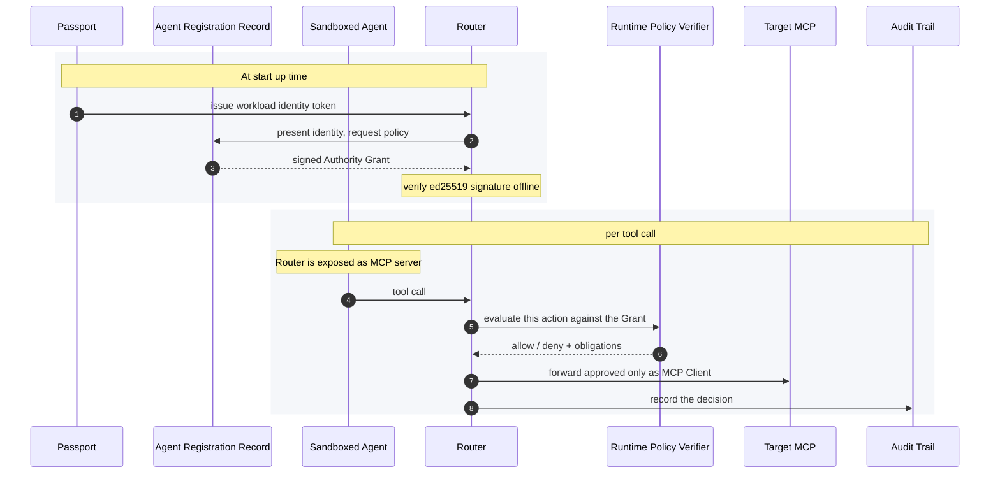
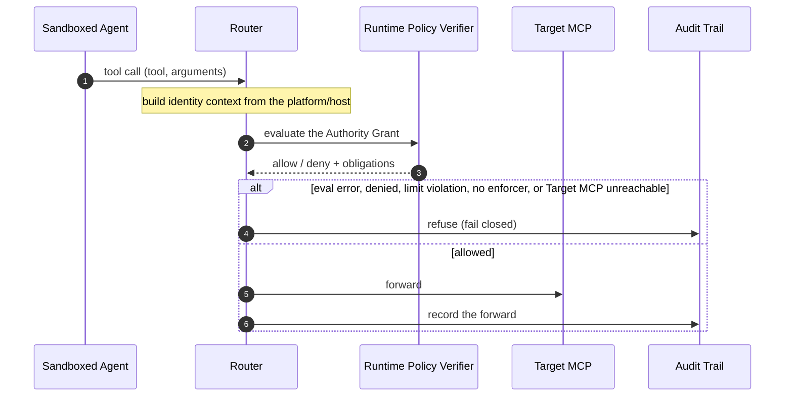
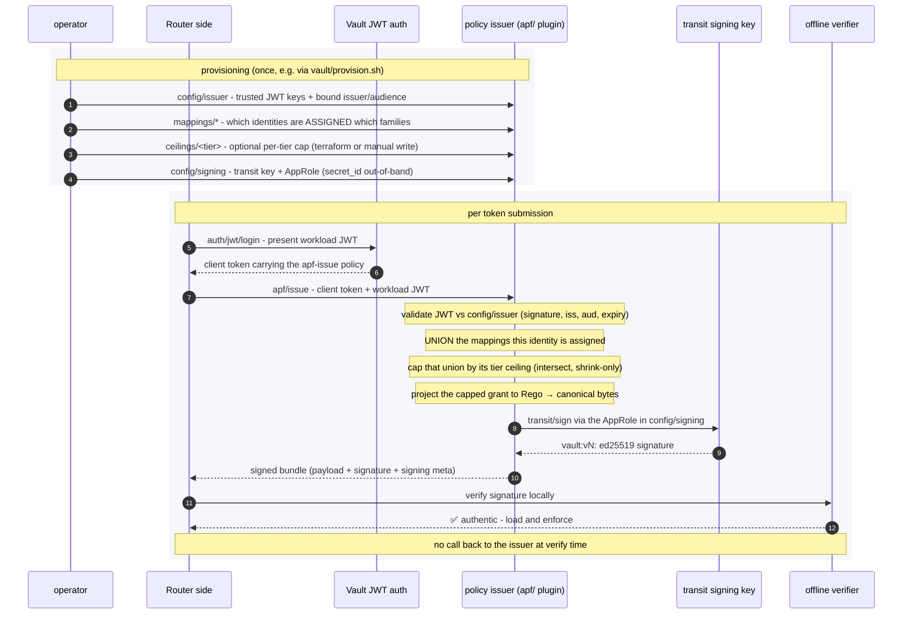
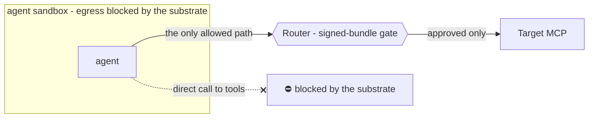

# ODIS Contract Harness - a walkthrough

*Governed agent tool-use, built from open-source parts - as a kit of optional, composable
building blocks.*

*This is a walkthrough: what each block does, how you adopt them incrementally from a
laptop demo to an enforced checkpoint*

---

## 1. The idea: optional building blocks you adopt as you need them

**ODIS is a spec, not a product.** It defines a set of **understandable, optional building
blocks** - each with one clear contract - for delegating host identity to agent identity
to govern tool-call and MCP access. You adopt the blocks you need and compose them.

**This project is one candidate implementation of a narrow subset of those blocks** - a
concrete, 100%-OSS picture of a Router / governance checkpoint, signed policy issuance,
and substrate-enforced egress. It is an opinionated runnable prototype, not a normative
implementation of the full current ODIS or APF drafts.

The building blocks:

- **Passport** - a workload-identity provider, fixture today; the real SVID handoff is an
  unresolved integration boundary
- **Agent Registration Record System** - a **Vault plugin** that resolves a validated Passport to its authorized policy: the **union** of the grants it's been assigned, capped by its tier ceiling
- **Authority Grant** - the runtime bundle declaring what the agent may do. A Vault-issued
  grant carries generated Rego projected from structured mapping/ceiling inputs; the local
  development bundle uses the same runtime shape but contains self-authored Rego
- **Tier Ceiling** - an operator-set **maximum-permission boundary** per tier; the assigned grants are intersected against it, so a tier can only ever *shrink* what an identity may do
- **Runtime Policy Verifier** - an OPA execution that evaluates the requested action against the Authority Grant to make a Policy Decision
- **Router** - a governance proxy, using the RPV as an authorizer, to forward approved actions
- **Bridge** - an optional fixture token-exchange seam for short-lived, audience-scoped
  Router-to-Target credentials; no production broker is included
- **Agent Sandbox** - an OpenShell environment, exposing the router as an MCP the agent can forward its requests through
- **Audit Trail** - the gate emits a structured record of every forward or refusal;
  OpenShell separately logs sandbox activity

The included signed-bundle demos use a fixture workload JWT to request policy;
`serve --signed` accepts a caller-supplied workload-JWT file. The per-call Router identity
is still constructed from separate fixture providers; this prototype does not yet bind a
real production SVID continuously across issuance, runtime calls, and audit.

---

## 2. The gate: decide the call, hold no upstream provider keys

The Router is the central block - the chokepoint every tool call converges on. It sits between
the agent and its tools and decides, per call, *whether* the call may pass. It **never holds the
Target MCP's upstream provider credential** for Jira, GitLab, or another provider. Optional
OAuth2 and Bridge modes do give the Router process-local credentials for the Router-to-Target
leg; the Target MCP still owns and uses the upstream provider credential.

Every governed call runs the same **fail-closed** sequence. Policy errors, missing
enforcers, and unreachable Target MCPs are refusals, and **every refusal is audited before
it is returned**. An unknown tool is refused in the demo's `strict` family; a deliberately
`permissive` family forwards an ungoverned tool without policy evaluation and audits that
mode explicitly.

---

## 3. The Router we built: Authority Grants and Tool Families

The Router is the harness's central block. Two things configure it: the
**Authority Grant it trusts**, and **how each tool family is policed**.

**The Authority Grant it runs on** - same Router, two ways to hand it policy:

| Authority Grant | How the Router trusts it | Where it's used |
|---|---|---|
| **Local file** (self-authored, unsigned) | by convention - you author a bundle and point the Router at it; the signature check is a fixture that accepts anything | `demo` and `serve` (without `--signed`) load the selected local bundle; the default is `policy/bundle.example.yaml` |
| **ARR-signed** | cryptographically - the Agent Registration Record system (Vault plugin) mints and transit-signs it, and the Router verifies the Ed25519 signature before trusting it (→ §4) | `serve --signed`, the OpenShell example, and `smoke-vault` |

The two share one source-agnostic loader: `serve --signed` fetches and offline-verifies the
Vault-issued bundle, while plain `serve` and `demo` load a local file.

### How the `serve` source and authentication flags compose

The grant source and Target MCP authentication are separate decisions:

| Option | Enabled | Not enabled |
|---|---|---|
| `--bundle PATH` | Plain `serve` selects `PATH` as its convention-trusted local grant. | Plain `serve` uses `$ODIS_BUNDLE`, then defaults to `policy/bundle.example.yaml`. Under `--signed`, local bundle selection is unused. |
| `--signed` | The Router performs workload-JWT login, calls `apf/issue`, and verifies the returned Vault-transit signature offline before loading the grant. | The Router does not contact Vault or verify a cryptographic signature; it loads the local YAML through the fixture verifier. |
| `--oauth2` | The Router authenticates to each Target MCP using interactive authorization-code/PKCE with dynamic client registration. | Unless `--bridge` is selected, the Router still attempts downstream discovery and calls with `auth=None`; an authentication-required Target MCP remains unreachable. |

`--oauth2` and the fixture `--bridge` mode are mutually exclusive; selecting both makes
`serve` exit with a usage error.

Therefore `serve --bundle policy/gitlab-readonly.bundle.yaml --oauth2` means a local,
fixture-trusted GitLab grant plus real downstream OAuth. `serve --signed --oauth2` means a
Vault-issued, offline-verified grant plus real downstream OAuth; that issued grant must
contain the GitLab route and policy. Adding `--bundle` to the signed command does not merge or
override the issued grant: the current CLI accepts the option but ignores it in signed mode.

The policy digest—and, for a Vault-issued grant, the signature—binds the whole canonical
runtime bundle: bundle metadata, Target MCP routing, Rego, governed tools, action limits, and
`default_mode`. A valid policy cannot be moved to a different Target MCP without changing
the signed bytes. MCP clients see family-prefixed names such as `jira-prod.update_issue`,
while family policy and action-limit dispatch use the unprefixed `update_issue` name.

**Tool Families** are a concept built into the Authority Grants for this router. They are
one provider's tools plus the policy that governs them, bound to that provider's Target MCP
endpoint. They are embedded in an Authority Grant (Jira's tools are one family, GitHub's another).
Before issuance, Vault mappings carry a structured **capability spec** - verbs, argument
conditions, and allowed fields. The plugin projects that into the runtime family's generated
Rego and governed-tools map. The runtime family also carries a `default_mode`: `permissive`
forwards requests when the bundle is silent, while `strict` rejects requests the bundle does
not define. A **Tier Ceiling** (§4) forces every family it caps to `strict`.

---

## 4. Sourcing the Authority Grant: Agent Registration Record System and Signed Bundles

A local file trusted by convention is the simple path; for stronger assurance, policies
can be given **signatures**. An issuer exchanges a short-lived **workload identity** for a **signed
policy bundle**; the Router verifies that signature before honoring it.

Two distinct cryptographic roles, deliberately kept separate:

| Role | Who it's for | What it does |
|---|---|---|
| **Workload identity** | the *caller* asking for a bundle | proves *who* is requesting policy (short-lived and audience-scoped in the fixture) |
| **Bundle signature** | the *bundle itself* | proves the policy is *authentic and untampered* - signing key never leaves the issuer |

**Concretely, the Agent Registration Record System is a HashiCorp Vault plugin** mounted at
`apf/`. The Router first exchanges its workload JWT at Vault's JWT auth mount for a client
token carrying the narrowly scoped `apf-issue` policy; it then presents that token plus the
workload JWT to the plugin to obtain a signed bundle:

1. **Validate the identity.** The JWT is verified against trust material in `config/issuer`
   - signature against the configured public keys (JWKS or PEM).
2. **Resolve the authority - by union, not by pick.** The validated identity is matched against
   the operator-written **mappings** (`mappings/<name>`). A mapping confers authority only through
   its **assigned** selectors - an exact subject, a subject subtree (`bound_subject_prefix`), or
   required claims; **issuer and audience are ambient trust gates that qualify a token but never
   confer a grant**. The identity's authority is the **union of every assigned mapping it matches**,
   their families merged - there is no "most-specific winner". Three things fail closed: an empty
   union (no assigned grant), two assigned mappings claiming the **same family** (each family has
   one owner), and a bundle envelope the assigned mappings leave **inconsistent or incomplete**
   (they must agree on it, and `bundle_id` / `bundle_version` / `trust_root_id` may not be blank -
   an empty envelope is never signed).
3. **Cap by the tier ceiling.** If the identity carries an `apf_tier` claim, the union is
   intersected against that tier's **ceiling** (`ceilings/<tier>`) - an operator-set
   **maximum-permission boundary**. The ceiling can only *shrink*: it drops families it doesn't
   permit, narrows each kept family to the verbs and fields it allows, and forces every kept family
   to `strict`. A tier claim naming a ceiling that isn't configured fails closed.
4. **Project the policy to Rego.** Each family's policy is a **structured capability spec** (verbs
   + argument conditions + allowed fields), which the plugin **compiles to Rego** - the *Policy
   Projection*. In the Vault-issued path this is the only way policy becomes Rego - an operator
   never writes raw Rego there, and a spec that can't compile (e.g. a duplicate verb) is
   rejected, not signed. (Local development bundles are different: they may carry self-authored
   Rego, trusted by convention - see §3.)
5. **Assemble, sign, return.** The projected grant is serialized to **canonical bytes** (sorted-key
   compact JSON) so the signature covers a deterministic representation; a grant declaring zero
   families is refused. The plugin authenticates with its own AppRole and calls `transit/sign` for
   an **Ed25519** signature over those bytes - the signing key lives in Vault's transit engine and
   **never leaves it**. The returned envelope - `{ payload, signature, signing }`, where
   `payload` is the base64-encoded canonical bundle bytes and `signing` carries the key
   name/version metadata - is everything the Router needs to verify **offline**, with no
   callback to Vault.

**Configuring it.** The runnable local path is `mise run smoke-vault`, backed by
`vault/provision.sh`. It configures issuer trust, an assigned mapping, the transit key,
and both scoped authentication legs. The optional tier ceiling is not part of the smoke
path — provision it via the Terraform module's `ceiling_tier` or a manual
`vault write apf/ceilings/<tier>`.

The `terraform/` module provisions the mounts, policies, roles, mapping, and plugin mount for
a persistent Vault. It registers the plugin when `plugin_sha256` is set; otherwise it reuses a
preregistered plugin. It intentionally omits `config/signing`: the plugin requires `role_id`
and `secret_id` together, and putting that write in Terraform would persist the secret in
state. Run `mise run tf:configure-signing` immediately after apply. This remains an advanced
operational path rather than part of the newcomer demo; see `terraform/README.md`.

---

## 5. Making the gate mandatory: the substrate

The gate is only as strong as the thing that **forces traffic through it**. A sandbox
substrate (**OpenShell or equivalent**) blocks the agent's direct network egress, so the
Router becomes the *only* path to any tool. That's the difference between advice and
enforcement.

**Takeaway:** signed policy decides; the substrate makes the decision unavoidable. Put
them together and "should" becomes "must."

---

## 6. Where this project is intentionally narrow

This harness leads with the piece a small team can run locally: a policy bundle, a Router,
real OPA evaluation, argument limits, and audit. It adds Vault issuance and OpenShell egress
enforcement as optional layers.

It does not attempt to settle the full ODIS identity, delegation, revocation, credential
mediation, or lifecycle model. The local term **Authority Grant** names this project's runtime
policy artifact; its Vault-issued form is signed and its local development form is trusted by
convention. It should not be read as a claim that the working ODIS draft lacks or must adopt
that exact concept.

---

## 7. Honesty boundary

These limits are stated plainly because they are what makes the rest credible:

- **Enforcement depends on the substrate.** Without something forcing egress through the
  Router, the gate is **advisory / governance-only**.
- **It's a subset, on purpose.** The harness omits a credential-vending pillar (the Target MCP
  holds its own credential) - which is exactly *why* substrate-enforced egress is a hard
  prerequisite, not a nice-to-have: without it, nothing stops the agent reaching the
  credential-holding Target MCP directly.
- **The production identity chain is not complete.** Bundle issuance and per-call Router
  identity use separate fixtures; real SVID delivery and binding remain unresolved.
- **No static or persisted secret on the gate→Target MCP leg.** Plain mode uses no credential.
  OAuth2 keeps access/refresh tokens and dynamic-registration information in process memory;
  the fixture Bridge caches a short-lived, audience-scoped bearer. Neither mode gives the
  Router the Target MCP's upstream provider credential, and no production broker is included.
- **One candidate reference, not a ratified standard.** ODIS is a working draft; this is
  *one* open-source implementation of the Router / governance-checkpoint wedge.

---

## Terms

The vocabulary this walkthrough uses - which spec or local model each term comes from, and
what plays it here. **Authority Grant** is local shorthand for this harness's runtime bundle:
Vault-issued grants are signed, while the local development path trusts a file by convention.
This is not a claim about normative ODIS terminology.

| Term | Source | In this harness |
|---|---|---|
| **Passport** | ODIS (Layer 1) | the workload-identity provider (fixture → SPIRE) |
| **Agent Registration Record** | ODIS working draft | the **Vault plugin** (`config/issuer` + `mappings` + `ceilings`): validates a Passport, resolves it to the **union** of its assigned grants, capped by its tier ceiling |
| **Authority Grant** | local harness vocabulary | the runtime bundle declaring *what* the agent may do; Vault-issued grants contain generated Rego projected from structured mapping inputs, while local development bundles may contain self-authored Rego |
| **Tier Ceiling** | *new* - permission boundary | an operator-set **maximum-permission** cap per tier (`ceilings/<tier>`, selected by the `apf_tier` claim); the assigned union is intersected against it, so a tier only ever *shrinks* authority |
| **Runtime Policy Verifier (RPV)** | - | the OPA execution acting as the **Policy Decision Point (PDP)**; makes a **Policy Decision** (allow/deny + obligations). the ODIS working draft names an external policy engine for this role |
| **Router / Governance Checkpoint** | ODIS (Layer 3) | the gate / PEP - governed calls run through the RPV; permissive ungoverned calls bypass policy evaluation. It may hold process-local Router-to-Target tokens, but never the Target MCP's upstream provider credential |
| **Sandbox** | ODIS (assumed, not defined) | OpenShell *or equivalent* - forces the agent's egress through the gate |
| **Audit Trail** | ODIS cross-cutting requirements | the audit sink - one record per forward or refusal; full dual-identity attribution is not implemented |

- **Authority Grant (local vocabulary).** In this harness the term means the runtime bundle
  declaring what the Router may forward. The Vault-issued form is signed; the local development
  form is convention-trusted. It pairs the identity question (*who*) with the policy question
  (*what may it do*) without claiming normative ODIS terminology.
- **Bridge (fixture only).** `serve --bridge` wires an in-process token exchanger that mints a
  short-lived bearer for each Target MCP audience. It demonstrates the integration seam but is
  not a production delegation broker; Target MCP servers still hold provider credentials.
