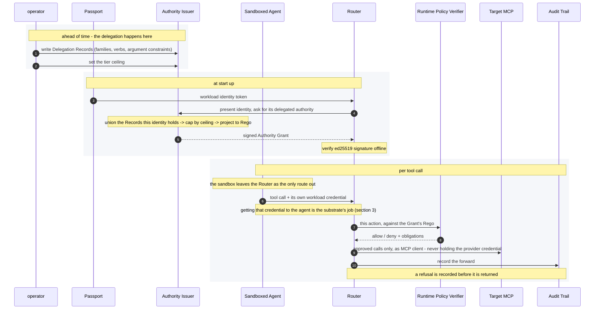
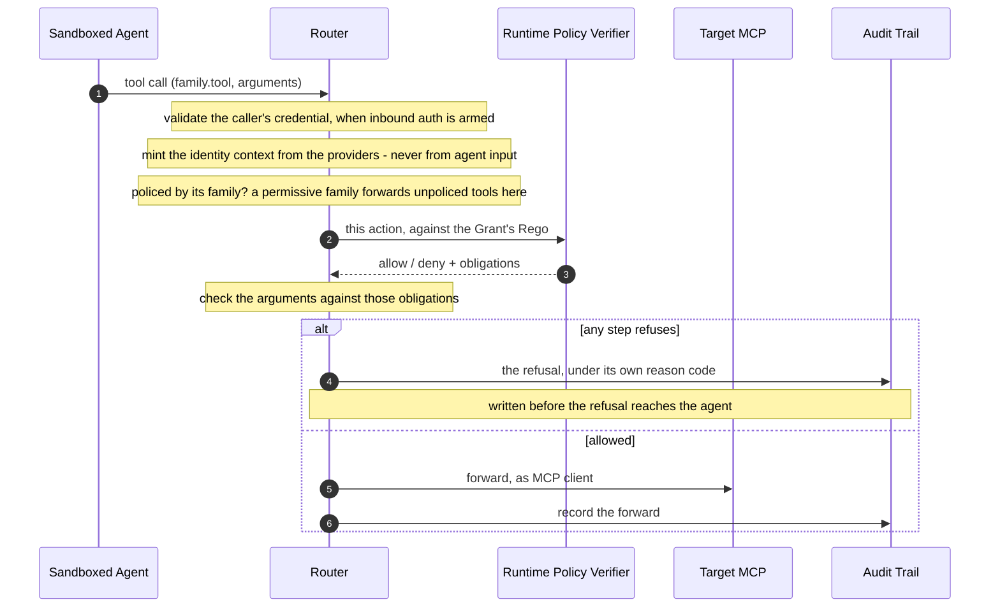
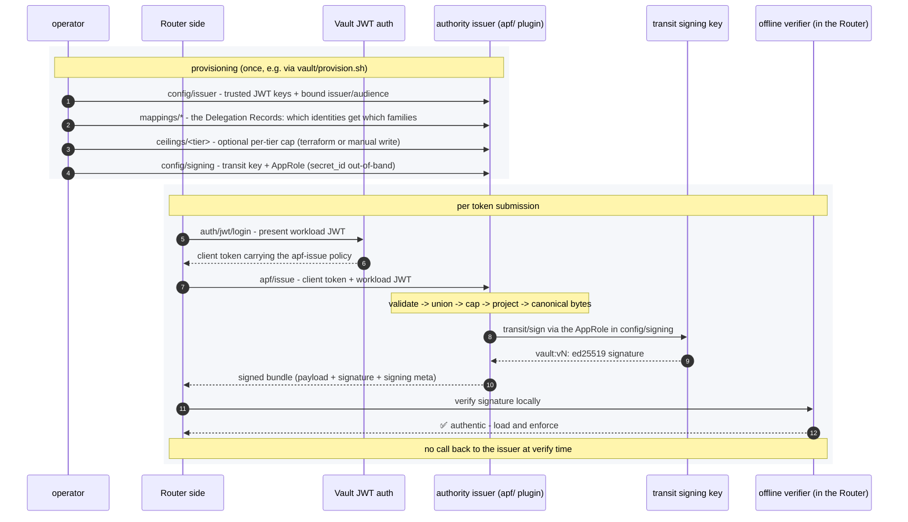
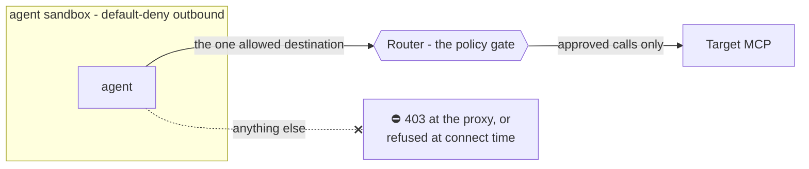

# ODIS Contract Harness - a walkthrough

*Governed agent tool-use, built from open-source parts. What each block does, and how you
adopt them incrementally from a laptop demo to an enforced checkpoint.*

For what this implementation does and does not claim against the ODIS draft,
requirement by requirement, see [`odis-conformance.md`](odis-conformance.md).

---

## 1. The idea: blocks you adopt in stages

**ODIS is a spec, not a product.** It defines three layers - Passport, Bridge, Router - plus
cross-cutting lifecycle and audit obligations, and sequences adoption in phases: workload
identity first, delegation second, governance checkpoints last. Adoption is incremental;
the requirements inside a profile you claim are not.

**The blocks.** The names come from two vocabularies, and a reader checking this against the
draft needs to know which is which. Passport, Router and Bridge are ODIS's layer names and
Delegation Record is one of its data models; Authority Issuer, Authority Grant and Tier
Ceiling are this project's, because ODIS names no role for them. Where a block is a stand-in
rather than a full implementation, its bullet says so.

- **Passport** - a workload-identity provider (ODIS Layer 1). Split down the middle: the
  Router verifies a workload JWT, and the issuer is `FixtureIdentityIssuer` standing in
  for SPIRE. Getting a credential into the agent's hands
  is the substrate's job, not this repo's (section 3).
- **Delegation Record** - ODIS's object for one delegation (§6.3): who delegated, to whom,
  for what task, until when, and the authority conveyed - integrity-protected by its issuer.
  The standing form here is a **Vault mapping** an operator writes: selectors naming who it
  applies to, plus the families and argument constraints it confers. That carries §6.3's
  authority fields - `granted_authorizations`, `resource_indicators`, `constraints` etc.
- **Authority Issuer** - a **Vault plugin** that resolves a validated Passport to the
  authority an operator delegated to it in advance: the **union** of the Delegation Records it
  has been assigned, capped by its tier ceiling, returned as a signed Authority Grant. This is
  where the harness does its Layer 2 work. ODIS names no issuer role of this kind, for the
  reason below.
- **Tier Ceiling** - an operator-set **maximum-permission boundary** per tier, selected by the
  agent's own `apf_tier` claim and applied once to the composed union, so it can only ever
  *shrink* what an identity may do. ODIS names no ceiling of this kind — §3.5 makes
  interoperability depend on "the data contracts between roles, not on packaging" — so the
  ceiling stays an internal safety property while what crosses the boundary is the signed
  Authority Grant. The **rules** it is applied under are specified, though, and are not the
  same object: the ceiling is the bound, while `attenuation_profile_ref` names the immutable,
  versioned normalization and comparison rules that define what "shrink" means on each axis
  (ODIS-L2-06). Change the ceiling and a different result comes out; change the profile and
  the *same* ceiling yields a different result, which is why a verifier needs both.
- **Authority Grant** - the runtime bundle declaring what the agent may do. For the Router it
  stands where a Delegation Record stands: the only statement of delegated authority there is,
  integrity-protected by its issuer and verified before it is trusted. It **aggregates** the 
  standing Delegation Records written by operators, one per tool family, with each family's
  Rego projected from its structured spec. Two composition rules keep the aggregate coherent:
  no two Records may claim the same family, and their envelopes must agree. §6.3 is
  single-valued on `originating_principal`, `actor`, `task_id` and `expires_at`, which reads
  as a constraint on this shape - one accountable delegator per identity, and Records that
  disagree should fail issuance rather than merge. Local vocabulary, not a normative ODIS term.
- **Runtime Policy Verifier** - an OPA execution evaluating the requested action against the
  Authority Grant to produce a Policy Decision. ODIS calls this the **External Policy Engine**,
  and ODIS-L3-06 permits the decision point to be "external or co-located".
  Organization-specific policy logic is present too: the Tier Ceiling is operator-set and
  org-wide rather than part of any one delegation, and the Rego a Grant carries is the
  delegation **intersected with** that ceiling.
- **Router** - a governance proxy using the RPV as its authorizer, forwarding approved
  actions only. ODIS calls this component the **Governance Checkpoint** and uses "Router" for
  the whole of Layer 3, which §3.3 splits three ways: tool discovery, the governance point,
  and operational safeguards. This implements the first two - a family-prefixed catalog
  filtered per family posture, and the gate itself.
- **Bridge** - how the Router authenticates to the Target MCP: a bridge-mode **Provider
  Adapter** in ODIS's terms (§3.2, ODIS-L2-15). Three options: no credential at all (the
  default, and the Secret-Zero one), an OAuth2 authorization-code/PKCE client with dynamic
  registration, or a fixture RFC 8693 exchanger minting a short-lived audience-scoped bearer.
  Only the last is a stand-in; no production token broker is included.

  It does a little more than authenticate with the correct credential based on the
  conclusion of the Runtime Policy Verifier. The exchanged token carries `sub=odis-router`
  with `act.sub=<agent>`, so a target learns  which agent the Router is acting for, and
  `BridgeAuth` handles expiry and re-mint under a lock.
- **Agent Sandbox** - an OpenShell environment that exposes the Router as the MCP server the
  agent must route through. ODIS names no sandbox requirement (§3.5). **ODIS-L3-08** asks
  that the boundary stay "independently enforceable" wherever Layer 3 controls are placed,
  and the sandbox is what makes that true. **ODIS-L2-10** requires any compatible execution
  path to keep the target credential "within an ODIS-controlled mediation point" - and
  without something blocking the agent's direct network access the Router is not that point,
  because the agent
  could reach the credential-holding Target MCP itself. Both rows are scored conditional on
  this mode being the one in use.
- **Audit Trail** - one schema-validated JSON line per forward or refusal, carrying a
  `correlation_id` threaded through every event for an action and the `policy_digest` of the
  exact grant that authorized it. A refusal is written *before* it is returned, so the
  fail-closed path cannot drop its own record. ODIS files this under **CC-01** (observability)
  and **CC-02** (dual-identity audit trail). CC-02 wants three identities per logged action;
  `extra.actor` carries two - the acting agent and the originating principal - and the
  executing runtime instance is absent, because nothing in a validated bearer distinguishes
  this run of an agent from the agent. OpenShell's own sandbox log shares no identifier with
  this one - so CC-01's correlation across agent, checkpoint and adapter stops at the Router.

Two seams in that picture are thinner than the arrows suggest. The signed-bundle demos use a
fixture workload JWT to ask for authority, and `serve --signed` accepts a caller-supplied
workload-JWT file. And the identity the Router builds per call comes from separate fixture
providers, so no single SVID is bound continuously across issuance, runtime calls and audit -
the operator writing Records, the identity presented at issuance, and the agent calling the
gate are three unlinked identities here rather than one chain.

---

## 2. The gate: decide the call, hold no provider keys

The Router is the central block - the chokepoint every tool call converges on. It sits
between the agent and its tools and decides, per call, *whether* the call may pass. It
**never holds the Target MCP's upstream provider credential** for Jira, GitLab, or any other
provider. The optional OAuth2 and Bridge modes give the Router process-local credentials for
the Router-to-Target leg only; the Target MCP still owns and uses the provider credential.

Every governed call runs the same **fail-closed** sequence. Policy errors, missing enforcers,
and unreachable Target MCPs are all refusals, and **every refusal is audited before it is
returned**. An unknown tool is refused in a `strict` family; a deliberately `permissive`
family forwards an ungoverned tool without policy evaluation and audits that mode explicitly.

Before any of that, the caller's own credential is checked - when `serve` is started with
inbound trust material, a workload JWT is validated for signature, issuer, audience and expiry
before a handler runs, and the agent id is its verified subject (section 3). Auth configured but no
token arriving at the handler refuses under `unattributed_caller` rather than quietly falling
back to the anonymous id.

---

## 3. Configuring the Router: Authority Grants and Tool Families

Two things configure the Router: **the Authority Grant it trusts**, and **how each tool
family is policed**.

The harness supports three trust modes, to demonstrate the "good", "better", "best"
mentality of ODIS.

| Trust mode | Grant source | What is checked | Where it's used |
|---|---|---|---|
| `--trust-bundle-unverified` | local file | nothing. The payload is loaded as authored | `mise run demo`; local development |
| `--bundle-pubkey-file` | local file | a sibling `<bundle>.sig`, against a base64 Ed25519 transit public key you supply | `serve` against a bundle signed out of band |
| `--signed` | Vault-issued | the issued payload's Ed25519 transit signature, verified **offline** (see section 4) | `serve --signed`, `demo --signed`, the OpenShell example, `smoke-vault` |

Omitting all three exits 2 rather than picking one, because the only safe-looking default -
load it and check nothing - is the one an operator should have to type. All three share a
single source-agnostic loader.

### How the `serve` flags compose

Grant source and Target MCP authentication are separate decisions:

| Option | Enabled | Not enabled |
|---|---|---|
| `--bundle PATH` | Plain `serve` selects `PATH` as its local grant. | Plain `serve` uses `$ODIS_BUNDLE`, then `policy/bundle.example.yaml`. Under `--signed`, local bundle selection is unused. |
| `--signed` | The Router performs workload-JWT login, calls `apf/issue`, and verifies the returned transit signature offline before loading the grant. | No Vault call; the grant comes from a local file, and one of the two local trust modes below is then required. |
| `--bundle-pubkey-file PATH` | Supplies the base64 Ed25519 transit public key used as the offline trust anchor - verifying the Vault payload under `--signed`, or a sibling `<bundle>.sig` on a local grant. | Under `--signed` it is required together with `--vault-addr` and `--vault-jwt-file` (or their env vars), and a partial set exits 2; on a local grant, `--trust-bundle-unverified` is the remaining option. |
| `--trust-bundle-unverified` | Loads the local `--bundle` with its signature unchecked, and the startup banner says so. | Nothing is implied - if neither this nor another trust mode is given, startup exits 2. |
| `--oauth2` | The Router authenticates to each Target MCP with authorization-code/PKCE and dynamic client registration. | Unless `--bridge` is selected, the Router still attempts downstream discovery and calls with `auth=None`; an authentication-required Target MCP remains unreachable. |

`--oauth2` and `--bridge` are mutually exclusive; selecting both exits with a usage error.

So `serve --bundle policy/gitlab-readonly.bundle.yaml --oauth2` is a local grant plus
downstream OAuth, and `serve --signed --oauth2` is a Vault-issued, offline-verified grant plus
downstream OAuth - where that issued grant must itself contain the GitLab route and
policy. Adding `--bundle` to a signed command neither merges nor overrides: the CLI accepts
the option and ignores it.

The policy digest - and, for a Vault-issued grant, the signature - covers the whole canonical
bundle: metadata, Target MCP routing, Rego, governed tools, action limits, and `default_mode`.
A valid policy cannot be moved to a different Target MCP without changing the signed bytes.
MCP clients see family-prefixed names like `jira-prod.update_issue`, while family policy and
action-limit dispatch key on the unprefixed `update_issue`.

**Tool Families** are one provider's tools plus the policy governing them, bound to that
provider's Target MCP endpoint, embedded in an Authority Grant - Jira's tools are one family,
GitHub's another. Before issuance the Delegation Records an operator wrote (section 1) carry each
family as a structured **capability spec** - verbs, argument conditions, allowed fields -
which the plugin projects into that family's generated Rego and governed-tools map. Each
family also carries a `default_mode`: `permissive` forwards requests the bundle is silent
about, `strict` rejects them. A **Tier Ceiling** (section 4) forces every family it caps
  to `strict`.

### Where the agent's credential comes from

`--inbound-key`, `--inbound-issuer` and `--inbound-audience` are required together. A key
without bindings accepts any token that key ever signed, including one minted for a different
service; bindings without a key serve an unauthenticated surface. A partial configuration
exits non-zero rather than starting.

**The harness verifies; it does not issue.** In production the agent fetches a JWT-SVID from
SPIRE's Workload API and re-fetches before expiry, and the Router is pointed at that issuer's
public keys. Here `fixtures/issuer.py:FixtureIdentityIssuer` stands in. The three trust
settings are the same ones the Vault plugin's `config/issuer` takes, so one IdP serves both
the agent-to-Router and Router-to-Vault legs - and requiring `iss` targets SPIRE behind its
OIDC Discovery Provider, or any OIDC-shaped IdP, rather than a raw Workload API SVID.

**The substrate delivers the credential to the agent to router path; the agent never holds it.**
On an OpenShell substrate the agent is handed a *placeholder* and the egress proxy substitutes
the real value on the way out, so the credential is never in the sandbox. Four things this
requires, all of them load-bearing:

- A **provider profile** whose endpoint names the Router's host, port and `path`, with
  `protocol: mcp`. Placeholder resolution is endpoint-scoped, so a credential bound to one
  endpoint will not resolve at another.
- A credential with `auth_style: bearer` and `header_name: authorization`, registered with
  `openshell provider create` and attached with `sandbox create --provider`.
- `providers_v2_enabled` set on the gateway: `openshell settings set --global --key
  providers_v2_enabled --value true`.
- The agent sending **`Authorization: Bearer $ODIS_AGENT_JWT`**, reading the placeholder from
  its environment. The env value is a *versioned* name
  (`openshell:resolve:env:v<digits>_ODIS_AGENT_JWT`), so it must be read rather than
  constructed, and the `Bearer ` prefix must be present - the proxy substitutes the token, it
  does not build the header. A placeholder it cannot resolve is refused with
  `unresolved credential placeholder in request` rather than forwarded.

The Router then validates it like any other inbound credential, and `agent_id` becomes the
verified subject: an audit event from that path reads
`agent={"id": "spiffe://…", "type": "verified_bearer"}` rather than the `mcp-client` constant.

**This implementation does not attempt to incorproate TLS.** `serve` listens on plain HTTP and
takes no certificate or key.

---

### The three demos are one topology

Each adds exactly one layer over the previous, so a difference in behaviour is attributable
to a single change:

| task | grant | signature | inbound auth | substrate | needs |
|---|---|---|---|---|---|
| `mise run demo` | local file | none (`--trust-bundle-unverified`) | armed | none | nothing |
| `mise run demo-signed` | Vault-issued | **ed25519, offline** | armed | none | vault |
| `mise run demo-openshell` | Vault-issued | ed25519 | none | **OpenShell** | vault + openshell |

`mise run smoke-vault` is not on this ladder — it is an issuance test with no Router and no
gate at all.

---

## 4. Sourcing the Authority Grant: signed bundles

An issuer exchanges a short-lived **workload identity** for a **signed** grant. Two keys,
deliberately separate: the workload identity proves who is asking, and an **Ed25519**
signature proves the returned grant is authentic and untampered.

**Concretely, the issuer is a HashiCorp Vault plugin** mounted at `apf/`, reached over two
legs: the Router exchanges its workload JWT at Vault's JWT auth mount for a client token
carrying the narrowly scoped `apf-issue` policy, then presents that token *plus* the workload
JWT to the plugin. The token authorizes the call; the JWT is the subject the grant is built
for.

1. **Validate the identity** against `config/issuer` - signature over the configured public
   keys (JWKS or PEM), plus issuer, audience and expiry.
2. **Resolve the authority**: union the Delegation Records this identity is assigned, then cap
   that union by its tier ceiling. Section 1 covers the composition rules and what fails
   closed; the plugin is where they run.
3. **Project to Rego.** Each family's capability spec is compiled, so on this path an operator
   never writes raw Rego and a spec that cannot compile is rejected rather than signed.
4. **Assemble, sign, return.** The grant is serialized to **canonical bytes** (sorted-key
   compact JSON) so the signature covers a deterministic representation, and a grant declaring
   zero families is refused. The plugin authenticates with its own AppRole and calls
   `transit/sign` for an **Ed25519** signature; the signing key lives in Vault's transit engine
   and never leaves it. The returned `{ payload, signature, signing }` - `payload` being the
   base64-encoded canonical bytes - is everything the Router needs to verify **offline**, with
   no callback to Vault.

**Trying it locally.** `mise run smoke-vault` boots a dev Vault, runs `vault/provision.sh`,
then issues one grant and verifies it offline. There is no Router and no gate on that path -
it tests issuance alone.

`provision.sh` writes the five things the flow needs, each scoped to one capability:

- `transit/keys/apf-bundle` - the ed25519 signing key, non-exportable.
- an AppRole `apf-signer` whose policy grants **only** `transit/sign/apf-bundle`. This is the
  plugin's own credential for signing.
- a JWT auth role `router` whose policy grants **only** `apf/issue`. This is the Router's
  credential for asking.
- `apf/config/signing` and `apf/config/issuer` - the AppRole above, and the trust material
  the workload JWT is checked against.
- one Delegation Record under `apf/mappings/` - a single `jira-prod` family allowing
  `update_issue` on `APF-*` keys, labels only.

It writes no tier ceiling, so the capping step is a no-op on that path - it is covered by
the plugin's own tests instead. `ceilings_internal_test.go` and
`policydsl/intersect_internal_test.go` cover the narrowing: a family the ceiling omits is
dropped, a family capped to zero rules is dropped, disjoint field sets drop the verb,
conditions AND together, an empty ceiling field list keeps the grant, and a tier claiming
an unconfigured ceiling is denied rather than left uncapped. To exercise it end to end,
set the Terraform module's `ceiling_tier` and `ceiling_spec`, or write one directly with
`vault write apf/ceilings/<tier>`.

The `terraform/` module provisions the mounts, policies, roles, mapping, and plugin mount for
a persistent Vault, registering the plugin when `plugin_sha256` is set and otherwise reusing a
preregistered one. It intentionally omits `config/signing`: the plugin requires `role_id` and
`secret_id` together, and putting that write in Terraform would persist the secret in state.
Run `mise run tf:configure-signing` immediately after apply. This is an advanced operational
path, not part of the newcomer demo - see `terraform/README.md`.

---

## 5. Making the gate mandatory: the sandbox

The gate is only as strong as the thing that **forces traffic through it**. A sandbox
(**OpenShell or equivalent**) blocks the agent's outbound connections to everything except the
Router, so the Router becomes the *only* route to any tool. The agent does not decline to
bypass the gate - it cannot. Section 1 names the two ODIS requirements this answers.

It bounds the **agent**, and nothing else. The sandbox constrains one process's network
access; it says nothing about who else can reach the Router. That is why the Router still needs
its own inbound authentication and a TLS terminator in front of it - the sandbox is not a
substitute for either.

---

## Terms

Whose vocabulary each name comes from. What each one *does* is in section 1.

| Term | Source |
|---|---|
| **Passport** | ODIS Layer 1 |
| **Authority Issuer** | local vocabulary; ODIS names no role that issues a policy |
| **Authority Grant** | local vocabulary |
| **Delegation Record** | ODIS §6.3 |
| **Tier Ceiling** | *new* - permission boundary |
| **Runtime Policy Verifier (RPV)** | APF |
| **Router / Governance Checkpoint** | ODIS §3.5 role: *Governance Checkpoint* |
| **Bridge** | ODIS Layer 2 |
| **Sandbox** | ODIS-L3-08 (Boundary Protection) |
| **Audit Trail** | ODIS §5.4 cross-cutting (CC-01, CC-02, CC-06) |
